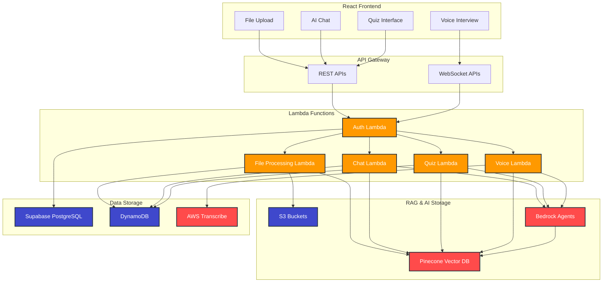
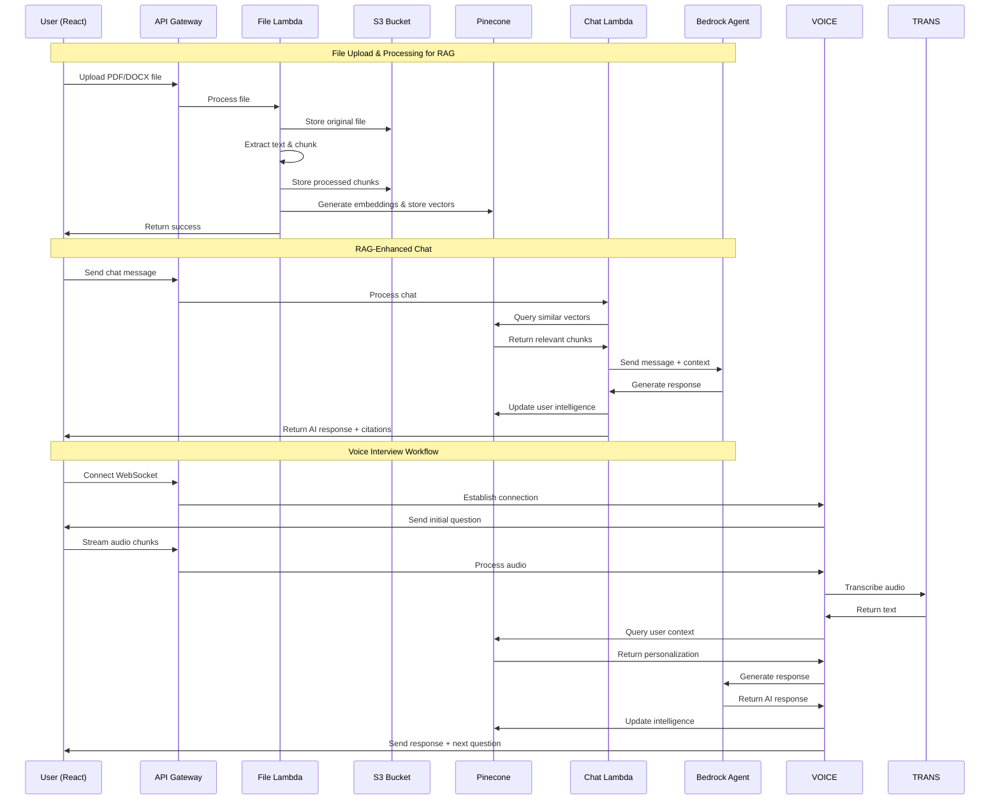
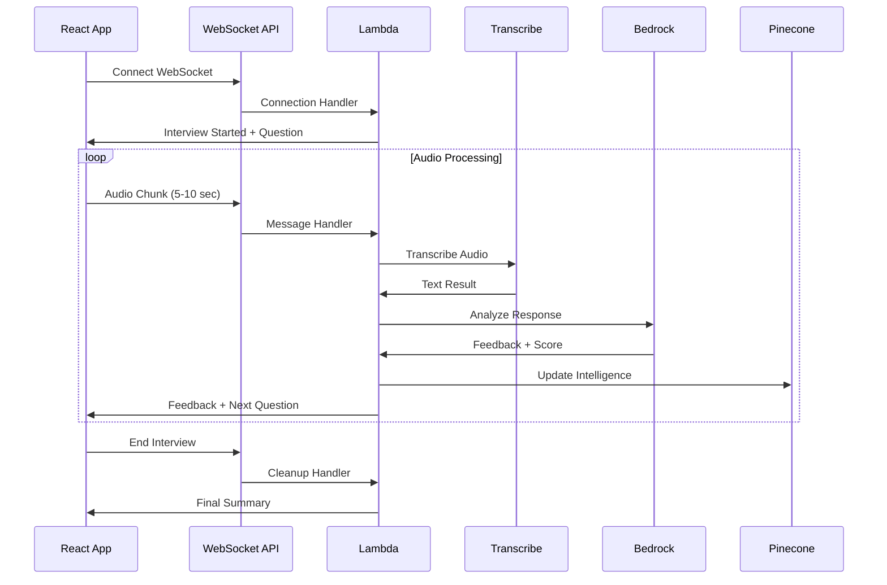

# LMS API Backend Design

## Overview

This design document outlines a RESTful API backend with WebSocket support for real-time features, built using FastAPI and AWS services. The system integrates with an existing React frontend and Supabase authentication to provide comprehensive LMS functionality.

## Architecture

### High-Level Architecture


### Technology Stack
- **API Framework**: AWS Lambda functions with Bedrock Agent SDK
- **Authentication**: Supabase JWT token validation in Lambda authorizer
- **Database**: Supabase PostgreSQL (existing schema unchanged)
- **AI Data Storage**: DynamoDB for chat history, file metadata, quiz data
- **RAG Storage**: S3 for processed documents + Pinecone for vector embeddings
- **Personalization**: Pinecone vector database for user intelligence/mastery tracking
- **File Processing**: Lambda functions for text extraction and chunking
- **Real-time**: API Gateway WebSocket for voice interviews
- **AI Services**: Multiple specialized AWS Bedrock Agents with Nova LLM
- **Knowledge Management**: Pinecone vector database for RAG retrieval
- **Speech Processing**: AWS Transcribe for speech-to-text
- **Deployment**: Serverless - no EC2 needed, just Lambda functions

## Detailed RAG Workflow



## RAG Storage Strategy

### File Processing Pipeline
1. **Original Storage**: Raw files (PDF, DOCX, TXT) stored in S3 `raw-files/` bucket
2. **Text Extraction**: Lambda extracts text using PyPDF2, python-docx
3. **Chunking**: Text split into 1000-character chunks with 200-character overlap
4. **Processed Storage**: Chunks stored in S3 `processed-chunks/` bucket as JSON
5. **Vector Storage**: Embeddings generated and stored in Pinecone with metadata
6. **Metadata Storage**: File info and processing status in DynamoDB

### S3 Bucket Structure
```
lms-documents/
├── raw-files/
│   └── user_{user_id}/
│       ├── {file_id}_original.pdf
│       └── {file_id}_original.docx
├── processed-chunks/
│   └── user_{user_id}/
│       ├── {file_id}_chunks.json
│       └── {file_id}_metadata.json
└── assignments/
    └── subject_{subject_id}/
        └── {assignment_id}_materials.json
```

### Pinecone Multi-Subject Organization

#### **Index Structure with Namespaces**
```
lms-vectors (Single Index)
├── Namespace: "documents" (RAG content)
└── Namespace: "intelligence" (User personalization)
```

#### **RAG Documents Vector Structure**
```json
{
  "id": "user_{user_id}_{subject_id}_{file_id}_chunk_{chunk_id}",
  "values": [0.1, 0.2, ...],  // 1536-dimensional embedding
  "metadata": {
    "user_id": "user_123",
    "subject_id": "physics_101",           // Links to Supabase subjects
    "subject_name": "Physics 101",
    "file_id": "file_456", 
    "chunk_index": 0,
    "text": "Newton's first law states...",
    "source_file": "physics_notes.pdf",
    "upload_date": "2024-01-15",
    "document_type": "notes",              // notes, assignment, textbook
    "session_id": "session_789",          // Optional: class session
    "tags": ["mechanics", "newton", "laws"]
  }
}
```

#### **User Intelligence Vector Structure**
```json
{
  "id": "user_{user_id}_{subject_id}_{concept}",
  "values": [0.1, 0.2, ...],  // Concept mastery embedding
  "metadata": {
    "user_id": "user_123",
    "subject_id": "physics_101",
    "concept": "newtons_laws",
    "mastery_level": 0.75,                // 0.0 to 1.0
    "interaction_count": 15,
    "last_interaction": "2024-01-15T10:30:00Z",
    "difficulty_preference": "intermediate",
    "learning_style": "visual"
  }
}
```

## Components and Interfaces

### Serverless Lambda Architecture
```python
# Lambda function structure using Bedrock Agent SDK
import json
import boto3
import os
from typing import Dict, Any
import pinecone
from supabase import create_client

# AWS clients (initialized once per Lambda container)
bedrock_agent = boto3.client('bedrock-agent-runtime')
s3_client = boto3.client('s3')
dynamodb = boto3.resource('dynamodb')
transcribe = boto3.client('transcribe')

# Pinecone initialization
pinecone.init(
    api_key=os.getenv('PINECONE_API_KEY'),
    environment=os.getenv('PINECONE_ENVIRONMENT')
)

# Supabase client (read-only for existing data)
supabase = create_client(
    os.getenv('SUPABASE_URL'),
    os.getenv('SUPABASE_ANON_KEY')
)

# Lambda response helper
def lambda_response(status_code: int, body: Dict[Any, Any]) -> Dict[str, Any]:
    return {
        'statusCode': status_code,
        'headers': {
            'Content-Type': 'application/json',
            'Access-Control-Allow-Origin': '*',
            'Access-Control-Allow-Methods': 'GET,POST,PUT,DELETE,OPTIONS',
            'Access-Control-Allow-Headers': 'Content-Type,Authorization'
        },
        'body': json.dumps(body)
    }

# API Gateway Lambda Authorizer
def lambda_authorizer(event, context):
    """Validate Supabase JWT tokens"""
    try:
        token = event['authorizationToken'].replace('Bearer ', '')
        
        # Validate JWT with Supabase (simplified)
        payload = jwt.decode(token, options={"verify_signature": False})
        user_id = payload.get("sub")
        
        if not user_id:
            raise Exception("Invalid token")
        
        # Get user info from Supabase
        user_data = supabase.table('users').select('*').eq('auth_user_id', user_id).execute()
        
        return {
            'principalId': user_id,
            'policyDocument': {
                'Version': '2012-10-17',
                'Statement': [{
                    'Action': 'execute-api:Invoke',
                    'Effect': 'Allow',
                    'Resource': event['methodArn']
                }]
            },
            'context': {
                'user_id': user_data.data[0]['user_id'] if user_data.data else user_id,
                'email': payload.get('email', ''),
                'role': user_data.data[0]['active_role'] if user_data.data else 'student'
            }
        }
    except Exception as e:
        raise Exception('Unauthorized')
```

# Supabase client for auth validation only (no schema changes)
supabase = create_client(SUPABASE_URL, SUPABASE_ANON_KEY)

# DynamoDB for all LMS data storage
dynamodb = boto3.resource('dynamodb')

# Pinecone for personalized intelligence tracking
import pinecone
pinecone.init(api_key=PINECONE_API_KEY, environment=PINECONE_ENVIRONMENT)

# Multiple Bedrock Agents for specialized tasks
BEDROCK_AGENTS = {
    "chat_agent": "agent-id-for-general-chat",
    "quiz_agent": "agent-id-for-quiz-generation", 
    "interview_agent": "agent-id-for-voice-interviews",
    "analysis_agent": "agent-id-for-learning-analysis"
}

# Knowledge Base management with S3 data source
class KnowledgeBaseManager:
    """Manage Knowledge Bases with S3 data source (no OpenSearch)"""
    
    def __init__(self):
        self.kb_client = boto3.client('bedrock-agent')
        self.s3_client = boto3.client('s3')
        self.dynamodb_table = dynamodb.Table('lms-knowledge-bases')
        self.user_kb_cache = {}
    
    async def get_user_knowledge_base(self, user_id: str) -> str:
        """Get or create Knowledge Base for user"""
        if user_id in self.user_kb_cache:
            return self.user_kb_cache[user_id]
        
        # Check if user KB exists in DynamoDB
        try:
            response = self.dynamodb_table.get_item(Key={'user_id': user_id})
            if 'Item' in response:
                kb_id = response['Item']['knowledge_base_id']
            else:
                # Create new KB for user with S3 data source
                kb_id = await self._create_user_knowledge_base_s3(user_id)
                
                # Store in DynamoDB
                self.dynamodb_table.put_item(Item={
                    'user_id': user_id,
                    'knowledge_base_id': kb_id,
                    'created_at': datetime.utcnow().isoformat(),
                    's3_prefix': f'users/{user_id}/documents/'
                })
        except Exception as e:
            logger.error(f"Error managing Knowledge Base: {e}")
            raise
        
        self.user_kb_cache[user_id] = kb_id
        return kb_id
    
    async def _create_user_knowledge_base_s3(self, user_id: str) -> str:
        """Create Knowledge Base with S3 data source"""
        kb_config = {
            'name': f'user-kb-{user_id}',
            'description': f'Personal Knowledge Base for user {user_id}',
            'roleArn': 'arn:aws:iam::account:role/BedrockKBRole',
            'knowledgeBaseConfiguration': {
                'type': 'VECTOR',
                'vectorKnowledgeBaseConfiguration': {
                    'embeddingModelArn': 'arn:aws:bedrock:us-east-1::foundation-model/amazon.titan-embed-text-v1'
                }
            },
            'storageConfiguration': {
                'type': 'PINECONE',
                'pineconeConfiguration': {
                    'connectionString': PINECONE_CONNECTION_STRING,
                    'credentialsSecretArn': PINECONE_CREDENTIALS_SECRET_ARN,
                    'namespace': f'user-{user_id}',
                    'fieldMapping': {
                        'textField': 'text',
                        'metadataField': 'metadata'
                    }
                }
            }
        }
        
        response = self.kb_client.create_knowledge_base(**kb_config)
        return response['knowledgeBase']['knowledgeBaseId']

class PersonalizationService:
    """Manage user intelligence and mastery in Pinecone"""
    
    def __init__(self):
        self.index = pinecone.Index("lms-user-intelligence")
        self.bedrock_runtime = boto3.client('bedrock-runtime')
    
    async def update_user_intelligence(self, user_id: str, question: str, response: str):
        """Update user's concept mastery based on interaction"""
        
        # Extract concepts from interaction
        concepts = await self._extract_concepts(question, response)
        
        # Generate embeddings for the interaction
        interaction_embedding = await self._generate_embedding(f"{question} {response}")
        
        for concept in concepts:
            vector_id = f"user_{user_id}_concept_{concept}"
            
            # Get current mastery or create new
            try:
                current_vector = self.index.fetch([vector_id])
                if vector_id in current_vector['vectors']:
                    current_metadata = current_vector['vectors'][vector_id]['metadata']
                    interaction_count = current_metadata.get('interaction_count', 0) + 1
                    current_mastery = current_metadata.get('mastery_level', 0.0)
                    
                    # Calculate new mastery level based on interaction quality
                    quality_score = await self._assess_interaction_quality(question, response, concept)
                    new_mastery = self._calculate_new_mastery(current_mastery, quality_score, interaction_count)
                else:
                    interaction_count = 1
                    new_mastery = 0.3  # Starting mastery
            except:
                interaction_count = 1
                new_mastery = 0.3
            
            # Update vector in Pinecone
            metadata = {
                "user_id": user_id,
                "concept": concept,
                "mastery_level": new_mastery,
                "interaction_count": interaction_count,
                "last_updated": datetime.utcnow().isoformat()
            }
            
            self.index.upsert([(vector_id, interaction_embedding, metadata)])
    
    async def get_user_personalization(self, user_id: str) -> dict:
        """Get user's learning profile for personalized responses"""
        
        # Query all user's concept vectors
        query_response = self.index.query(
            filter={"user_id": {"$eq": user_id}},
            top_k=100,
            include_metadata=True
        )
        
        if not query_response['matches']:
            return {
                "mastery_levels": {},
                "learning_style": "balanced",
                "difficulty_preference": "intermediate"
            }
        
        # Aggregate mastery levels
        mastery_levels = {}
        total_interactions = 0
        
        for match in query_response['matches']:
            metadata = match['metadata']
            concept = metadata['concept']
            mastery = metadata['mastery_level']
            interactions = metadata['interaction_count']
            
            mastery_levels[concept] = mastery
            total_interactions += interactions
        
        # Determine learning preferences based on interaction patterns
        avg_mastery = sum(mastery_levels.values()) / len(mastery_levels)
        
        if avg_mastery > 0.7:
            difficulty_preference = "advanced"
        elif avg_mastery > 0.4:
            difficulty_preference = "intermediate"
        else:
            difficulty_preference = "beginner"
        
        return {
            "mastery_levels": mastery_levels,
            "learning_style": "balanced",  # Could be enhanced with more analysis
            "difficulty_preference": difficulty_preference,
            "total_interactions": total_interactions
        }
    
    async def _generate_embedding(self, text: str) -> List[float]:
        """Generate embedding using Bedrock Titan"""
        response = self.bedrock_runtime.invoke_model(
            modelId='amazon.titan-embed-text-v1',
            body=json.dumps({"inputText": text})
        )
        
        response_body = json.loads(response['body'].read())
        return response_body['embedding']
    
    async def _assess_interaction_quality(self, question: str, response: str, concept: str) -> float:
        """Assess the quality of user interaction for mastery calculation"""
        
        # Simple heuristic - could be enhanced with AI analysis
        response_length = len(response.split())
        question_complexity = len(question.split())
        
        # Base quality score
        quality = 0.5
        
        # Adjust based on response length (longer responses often indicate better understanding)
        if response_length > 50:
            quality += 0.2
        elif response_length < 10:
            quality -= 0.2
        
        # Adjust based on question complexity
        if question_complexity > 10:
            quality += 0.1
        
        return max(0.0, min(1.0, quality))
    
    def _calculate_new_mastery(self, current_mastery: float, quality_score: float, interaction_count: int) -> float:
        """Calculate new mastery level using exponential moving average"""
        
        # Learning rate decreases as interaction count increases
        learning_rate = 0.1 / (1 + interaction_count * 0.01)
        
        # Update mastery with quality score
        new_mastery = current_mastery + learning_rate * (quality_score - current_mastery)
        
        return max(0.0, min(1.0, new_mastery))
```

### Authentication Middleware
```python
from fastapi import Depends, HTTPException, status
from fastapi.security import HTTPBearer, HTTPAuthorizationCredentials
import jwt

security = HTTPBearer()

async def get_current_user(credentials: HTTPAuthorizationCredentials = Depends(security)):
    """Validate Supabase JWT token and extract user info"""
    try:
        # Verify JWT token with Supabase
        token = credentials.credentials
        
        # Decode JWT to get user info
        payload = jwt.decode(token, options={"verify_signature": False})
        user_id = payload.get("sub")
        
        if not user_id:
            raise HTTPException(
                status_code=status.HTTP_401_UNAUTHORIZED,
                detail="Invalid authentication token"
            )
        
        # Get user data from existing users table (read-only, no schema changes)
        user_data = supabase.table('users').select('*').eq('auth_user_id', user_id).execute()
        
        if user_data.data:
            user_info = user_data.data[0]
            return {
                "auth_user_id": user_id,  # Supabase auth ID
                "user_id": user_info['user_id'],  # Your internal user ID
                "email": user_info['email'],
                "name": user_info['name'],
                "active_role": user_info['active_role'],
                "token": token
            }
        else:
            # User not found in existing system - return basic info
            return {
                "auth_user_id": user_id,
                "user_id": user_id,  # Use auth_user_id as fallback
                "email": payload.get("email"),
                "name": payload.get("user_metadata", {}).get("full_name", ""),
                "active_role": "student",
                "token": token
            }
    except jwt.InvalidTokenError:
        raise HTTPException(
            status_code=status.HTTP_401_UNAUTHORIZED,
            detail="Invalid authentication token"
        )
```

### File Processing Service
```python
### File Processing Lambda Function
```python
def file_upload_handler(event, context):
    """Lambda function to handle file uploads and RAG processing"""
    
    try:
        # Parse request
        body = json.loads(event['body'])
        user_id = event['requestContext']['authorizer']['user_id']
        
        # Get file from S3 (uploaded via presigned URL)
        file_key = body['file_key']
        file_name = body['file_name']
        
        # Process file for RAG
        rag_processor = RAGProcessor()
        result = await rag_processor.process_file(user_id, file_key, file_name)
        
        return lambda_response(200, {
            'file_id': result['file_id'],
            'status': 'processed',
            'chunks_created': result['chunk_count'],
            'vectors_stored': result['vector_count']
        })
        
    except Exception as e:
        return lambda_response(500, {'error': str(e)})

class RAGProcessor:
    """Handle RAG processing for uploaded files"""
    
    def __init__(self):
        self.s3_bucket = "lms-documents"
        self.files_table = dynamodb.Table('lms-user-files')
        self.pinecone_index = pinecone.Index("lms-rag-vectors")
        
    async def process_file(self, user_id: str, s3_key: str, filename: str) -> dict:
        """Process file for RAG storage"""
        
        file_id = str(uuid.uuid4())
        
        # 1. Download and extract text
        text_content = await self._extract_text_from_s3(s3_key)
        
        # 2. Chunk the text
        chunks = self._chunk_text(text_content)
        
        # 3. Store processed chunks in S3
        chunks_key = f"processed-chunks/user_{user_id}/{file_id}_chunks.json"
        await self._store_chunks_s3(chunks_key, chunks)
        
        # 4. Generate embeddings and store in Pinecone
        vector_count = await self._store_vectors_pinecone(user_id, file_id, chunks, filename)
        
        # 5. Store metadata in DynamoDB
        await self._store_file_metadata(file_id, user_id, filename, s3_key, chunks_key, len(chunks))
        
        return {
            'file_id': file_id,
            'chunk_count': len(chunks),
            'vector_count': vector_count
        }
    
    def _chunk_text(self, text: str, chunk_size: int = 1000, overlap: int = 200) -> List[dict]:
        """Split text into overlapping chunks for RAG"""
        
        chunks = []
        start = 0
        
        while start < len(text):
            end = start + chunk_size
            chunk_text = text[start:end]
            
            chunks.append({
                'index': len(chunks),
                'text': chunk_text,
                'start_pos': start,
                'end_pos': end,
                'length': len(chunk_text)
            })
            
            start = end - overlap
        
        return chunks
    
    async def _store_vectors_pinecone(self, user_id: str, file_id: str, chunks: List[dict], filename: str) -> int:
        """Generate embeddings and store in Pinecone"""
        
        vectors_to_upsert = []
        
        for chunk in chunks:
            # Generate embedding using Bedrock Titan
            embedding = await self._generate_embedding(chunk['text'])
            
            vector_id = f"user_{user_id}_file_{file_id}_chunk_{chunk['index']}"
            
            metadata = {
                'user_id': user_id,
                'file_id': file_id,
                'chunk_index': chunk['index'],
                'text': chunk['text'][:1000],  # Limit metadata size
                'source_file': filename,
                'upload_date': datetime.utcnow().isoformat(),
                'chunk_type': 'content'
            }
            
            vectors_to_upsert.append((vector_id, embedding, metadata))
        
        # Batch upsert to Pinecone
        self.pinecone_index.upsert(vectors_to_upsert)
        
        return len(vectors_to_upsert)
```
    
    async def upload_file(self, file: UploadFile, user_id: str) -> dict:
        """Upload and process file"""
        
        # Validate file
        if not self._is_valid_file(file):
            raise HTTPException(400, "Invalid file type or size")
        
        # Generate unique file ID and S3 key
        file_id = str(uuid.uuid4())
        s3_key = f"users/{user_id}/files/{file_id}_{file.filename}"
        
        # Upload to S3
        await self._upload_to_s3(file, s3_key)
        
        # Extract text content
        text_content = await self._extract_text(file, s3_key)
        
        # Get user's Knowledge Base
        user_kb_id = await self.kb_manager.get_user_knowledge_base(user_id)
        
        # Index in user's Knowledge Base
        kb_doc_id = await self._index_in_knowledge_base(text_content, user_kb_id, {
            "user_id": user_id,
            "file_id": file_id,
            "filename": file.filename,
            "s3_key": s3_key
        })
        
        # Store metadata in DynamoDB
        file_metadata = {
            "file_id": file_id,
            "user_id": user_id,
            "filename": file.filename,
            "s3_key": s3_key,
            "kb_document_id": kb_doc_id,
            "knowledge_base_id": user_kb_id,
            "status": "completed",
            "file_size": file.size,
            "content_preview": text_content[:200],
            "extracted_concepts": await self._extract_concepts(text_content),
            "upload_timestamp": datetime.utcnow().isoformat(),
            "ttl": int((datetime.utcnow() + timedelta(days=365)).timestamp())  # 1 year TTL
        }
        
        self.files_table.put_item(Item=file_metadata)
        
        return file_metadata
    
    async def get_user_files(self, user_id: str) -> List[dict]:
        """Get all files for a user from DynamoDB"""
        response = self.files_table.query(
            IndexName='user-id-index',
            KeyConditionExpression=Key('user_id').eq(user_id),
            ScanIndexForward=False  # Descending order
        )
        return response['Items']
```

### AI Chat Service
```python
### AI Chat Lambda Function
```python
def chat_handler(event, context):
    """Lambda function for AI chat with RAG"""
    
    try:
        body = json.loads(event['body'])
        user_id = event['requestContext']['authorizer']['user_id']
        message = body['message']
        conversation_id = body.get('conversation_id')
        
        # Process chat with LangGraph
        chat_service = LangGraphChatService()
        response = await chat_service.process_chat(user_id, message, conversation_id)
        
        return lambda_response(200, response)
        
    except Exception as e:
        return lambda_response(500, {'error': str(e)})

class LangGraphChatService:
    """Handle AI Agent interactions using LangChain + LangGraph orchestration"""
    
    def __init__(self):
        self.chat_table = dynamodb.Table('lms-chat-history')
        self.bedrock_kb_retriever = AmazonKnowledgeBasesRetriever(
            knowledge_base_id=os.getenv('BEDROCK_KB_ID'),
            retrieval_config={"vectorSearchConfiguration": {"numberOfResults": 10}}
        )
        
        # AWS services
        self.textract = boto3.client('textract')
        self.comprehend = boto3.client('comprehend')
        self.translate = boto3.client('translate')
        
        # LangChain LLM
        self.llm = BedrockLLM(
            model_id="anthropic.claude-3-sonnet-20240229-v1:0",
            region_name="us-east-1"
        )
        
        # Initialize LangGraph workflow
        self.agent_executor = self._create_langgraph_workflow()
    
    def _create_langgraph_workflow(self):
        """Create LangGraph workflow for AI agent orchestration"""
        
        from langgraph.graph import StateGraph, END
        from typing import TypedDict, List
        from langchain.schema import BaseMessage, HumanMessage, AIMessage
        
        # Define agent state
        class AgentState(TypedDict):
            messages: List[BaseMessage]
            user_id: str
            session_id: str
            documents: List[dict]
            intent: str
            context: List[dict]
            tools_used: List[str]
            final_response: str
            language: str
        
        # Create workflow graph
        workflow = StateGraph(AgentState)
        
        # Add processing nodes
        workflow.add_node("language_detection", self._detect_language_node)
        workflow.add_node("intent_detection", self._detect_intent_node)
        workflow.add_node("document_processing", self._process_documents_node)
        workflow.add_node("rag_retrieval", self._rag_retrieval_node)
        workflow.add_node("summarization", self._summarization_node)
        workflow.add_node("quiz_generation", self._quiz_generation_node)
        workflow.add_node("translation", self._translation_node)
        workflow.add_node("response_synthesis", self._response_synthesis_node)
        
        # Define workflow edges
        workflow.set_entry_point("language_detection")
        
        # Language detection -> Intent detection
        workflow.add_edge("language_detection", "intent_detection")
        
        # Conditional routing based on intent
        workflow.add_conditional_edges(
            "intent_detection",
            self._route_based_on_intent,
            {
                "summarize": "document_processing",
                "question": "rag_retrieval", 
                "quiz": "quiz_generation",
                "translate": "translation",
                "default": "rag_retrieval"
            }
        )
        
        # All paths lead to response synthesis
        workflow.add_edge("document_processing", "summarization")
        workflow.add_edge("summarization", "response_synthesis")
        workflow.add_edge("rag_retrieval", "response_synthesis")
        workflow.add_edge("quiz_generation", "response_synthesis")
        workflow.add_edge("translation", "response_synthesis")
        
        # End workflow
        workflow.add_edge("response_synthesis", END)
        
        return workflow.compile()
        
    async def process_chat(self, user_id: str, message: str, conversation_id: str = None) -> dict:
        """Process chat message using LangGraph workflow orchestration"""
        
        if not conversation_id:
            conversation_id = str(uuid.uuid4())
        
        # 1. Initialize conversation memory
        session_id = f"{user_id}_{conversation_id}"
        memory = DynamoDBChatMessageHistory(
            table_name="lms-chat-memory",
            session_id=session_id
        )
        
        # 2. Create initial agent state
        initial_state = {
            "messages": [HumanMessage(content=message)],
            "user_id": user_id,
            "session_id": session_id,
            "documents": [],
            "intent": "",
            "context": [],
            "tools_used": [],
            "final_response": "",
            "language": "en"
        }
        
        # 3. Execute LangGraph workflow
        result = await self.agent_executor.ainvoke(initial_state)
        
        # 4. Extract results
        ai_response = result["final_response"]
        tools_used = result["tools_used"]
        context_used = result.get("context", [])
        citations = self._extract_citations_from_context(context_used)
        
        # 5. Store conversation in memory and database
        memory.add_user_message(message)
        memory.add_ai_message(ai_response)
        
        await self._store_conversation(user_id, conversation_id, message, ai_response, citations, tools_used)
        
        # 6. Update user learning analytics
        await self._update_learning_analytics(user_id, message, result)
        
        return {
            'response': ai_response,
            'citations': citations,
            'conversation_id': conversation_id,
            'tools_used': tools_used,
            'intent_detected': result.get("intent", ""),
            'timestamp': datetime.utcnow().isoformat()
        }
    
    # LangGraph Workflow Nodes
    
    async def _detect_language_node(self, state: dict) -> dict:
        """Detect language using Amazon Comprehend"""
        
        user_message = state["messages"][-1].content
        
        try:
            # Detect dominant language
            language_detection = self.comprehend.detect_dominant_language(Text=user_message)
            detected_language = language_detection['Languages'][0]['LanguageCode']
            
            state["language"] = detected_language
            state["tools_used"].append("language_detection")
            
        except Exception as e:
            # Default to English if detection fails
            state["language"] = "en"
        
        return state
    
    async def _detect_intent_node(self, state: dict) -> dict:
        """Detect user intent using Amazon Comprehend"""
        
        user_message = state["messages"][-1].content
        
        try:
            # Extract key phrases for intent classification
            key_phrases_response = self.comprehend.detect_key_phrases(
                Text=user_message,
                LanguageCode=state["language"]
            )
            
            key_phrases = [phrase['Text'].lower() for phrase in key_phrases_response['KeyPhrases']]
            
            # Intent classification based on key phrases and patterns
            intent_keywords = {
                'summarize': ['summary', 'summarize', 'key points', 'overview', 'brief', 'main points'],
                'question': ['what', 'how', 'why', 'explain', 'tell me', 'describe'],
                'quiz': ['quiz', 'test', 'questions', 'assessment', 'exam'],
                'translate': ['translate', 'translation', 'language', 'convert']
            }
            
            detected_intent = "question"  # default
            for intent, keywords in intent_keywords.items():
                if any(keyword in user_message.lower() or keyword in key_phrases for keyword in keywords):
                    detected_intent = intent
                    break
            
            state["intent"] = detected_intent
            state["tools_used"].append("intent_detection")
            
        except Exception as e:
            state["intent"] = "question"  # fallback
        
        return state
    
    def _route_based_on_intent(self, state: dict) -> str:
        """Route to appropriate processing node based on detected intent"""
        
        intent = state.get("intent", "question")
        
        routing_map = {
            "summarize": "document_processing",
            "question": "rag_retrieval",
            "quiz": "quiz_generation", 
            "translate": "translation"
        }
        
        return routing_map.get(intent, "rag_retrieval")
    
    async def _process_documents_node(self, state: dict) -> dict:
        """Process documents using AWS Textract and Comprehend"""
        
        user_id = state["user_id"]
        
        # Get user's recent documents from Knowledge Base
        try:
            # Query for user's documents
            documents = await self.bedrock_kb_retriever.aget_relevant_documents(
                f"user_id:{user_id}"
            )
            
            processed_docs = []
            for doc in documents[:5]:  # Limit to recent documents
                # Extract entities and key phrases using Comprehend
                entities_response = self.comprehend.detect_entities(
                    Text=doc.page_content[:5000],  # Limit text size
                    LanguageCode=state["language"]
                )
                
                key_phrases_response = self.comprehend.detect_key_phrases(
                    Text=doc.page_content[:5000],
                    LanguageCode=state["language"]
                )
                
                processed_docs.append({
                    'content': doc.page_content,
                    'source': doc.metadata.get('source', 'Unknown'),
                    'entities': entities_response['Entities'],
                    'key_phrases': key_phrases_response['KeyPhrases']
                })
            
            state["documents"] = processed_docs
            state["tools_used"].append("document_processing")
            
        except Exception as e:
            state["documents"] = []
        
        return state
    
    async def _rag_retrieval_node(self, state: dict) -> dict:
        """Retrieve relevant context using Bedrock Knowledge Base"""
        
        user_message = state["messages"][-1].content
        user_id = state["user_id"]
        
        try:
            # Retrieve relevant documents
            relevant_docs = await self.bedrock_kb_retriever.aget_relevant_documents(
                f"{user_message} user_id:{user_id}"
            )
            
            context = []
            for doc in relevant_docs:
                context.append({
                    'content': doc.page_content,
                    'source': doc.metadata.get('source', 'Unknown'),
                    'score': doc.metadata.get('score', 0.0)
                })
            
            state["context"] = context
            state["tools_used"].append("rag_retrieval")
            
        except Exception as e:
            state["context"] = []
        
        return state
    
    async def _summarization_node(self, state: dict) -> dict:
        """Generate document summaries using Bedrock LLM"""
        
        documents = state.get("documents", [])
        
        if not documents:
            state["final_response"] = "No documents found to summarize."
            return state
        
        try:
            # Combine document content
            combined_content = "\n\n".join([
                f"Document: {doc['source']}\nContent: {doc['content'][:2000]}"
                for doc in documents
            ])
            
            # Create summarization prompt
            summary_prompt = f"""
            Please provide a comprehensive summary of the following documents:
            
            {combined_content}
            
            Include:
            1. Main topics and key concepts
            2. Important details and findings
            3. Conclusions or takeaways
            4. Source references
            
            Format the summary with clear headings and bullet points.
            """
            
            # Generate summary using Bedrock LLM
            summary = await self.llm.ainvoke(summary_prompt)
            
            state["final_response"] = summary
            state["tools_used"].append("summarization")
            
        except Exception as e:
            state["final_response"] = f"Error generating summary: {str(e)}"
        
        return state
    
    async def _quiz_generation_node(self, state: dict) -> dict:
        """Generate quiz questions using Bedrock LLM"""
        
        user_message = state["messages"][-1].content
        
        # First get relevant context
        state = await self._rag_retrieval_node(state)
        context = state.get("context", [])
        
        if not context:
            state["final_response"] = "No content available for quiz generation."
            return state
        
        try:
            # Combine context for quiz generation
            content_for_quiz = "\n\n".join([
                f"Source: {ctx['source']}\nContent: {ctx['content']}"
                for ctx in context[:3]  # Limit to top 3 most relevant
            ])
            
            quiz_prompt = f"""
            Based on the following content, generate 5 multiple-choice questions:
            
            {content_for_quiz}
            
            Format each question as:
            Q1: [Question text]
            A) [Option A]
            B) [Option B] 
            C) [Option C]
            D) [Option D]
            Correct Answer: [Letter]
            Explanation: [Brief explanation]
            
            Make questions that test understanding of key concepts.
            """
            
            quiz_response = await self.llm.ainvoke(quiz_prompt)
            
            state["final_response"] = quiz_response
            state["tools_used"].append("quiz_generation")
            
        except Exception as e:
            state["final_response"] = f"Error generating quiz: {str(e)}"
        
        return state
    
    async def _translation_node(self, state: dict) -> dict:
        """Handle translation using Amazon Translate"""
        
        user_message = state["messages"][-1].content
        source_language = state["language"]
        
        try:
            if source_language != 'en':
                # Translate to English for processing
                translation_response = self.translate.translate_text(
                    Text=user_message,
                    SourceLanguageCode=source_language,
                    TargetLanguageCode='en'
                )
                
                translated_text = translation_response['TranslatedText']
                
                # Update message for further processing
                state["messages"].append(AIMessage(content=f"Translated: {translated_text}"))
                
                # Continue with RAG retrieval using translated text
                temp_state = state.copy()
                temp_state["messages"][-1] = HumanMessage(content=translated_text)
                temp_state = await self._rag_retrieval_node(temp_state)
                
                # Translate response back to original language
                if temp_state.get("context"):
                    english_response = f"Based on your documents: {temp_state['context'][0]['content'][:500]}"
                    
                    final_translation = self.translate.translate_text(
                        Text=english_response,
                        SourceLanguageCode='en',
                        TargetLanguageCode=source_language
                    )
                    
                    state["final_response"] = final_translation['TranslatedText']
                else:
                    state["final_response"] = "No relevant content found in your documents."
                
                state["tools_used"].append("translation")
            else:
                # No translation needed, proceed with RAG
                state = await self._rag_retrieval_node(state)
                
        except Exception as e:
            state["final_response"] = f"Translation error: {str(e)}"
        
        return state
    
    async def _response_synthesis_node(self, state: dict) -> dict:
        """Synthesize final response using Bedrock LLM"""
        
        # If final_response is already set (from summarization, quiz, etc.), return as is
        if state.get("final_response"):
            return state
        
        user_message = state["messages"][-1].content
        context = state.get("context", [])
        
        try:
            if context:
                # Create context-aware response
                context_text = "\n\n".join([
                    f"From {ctx['source']}: {ctx['content']}"
                    for ctx in context[:3]
                ])
                
                synthesis_prompt = f"""
                User Question: {user_message}
                
                Relevant Context from User's Documents:
                {context_text}
                
                Please provide a helpful, accurate response based on the user's uploaded materials.
                Include specific references to the source documents when relevant.
                If the context doesn't fully answer the question, acknowledge this and provide what information is available.
                """
                
                response = await self.llm.ainvoke(synthesis_prompt)
                state["final_response"] = response
            else:
                # No context available
                fallback_prompt = f"""
                User Question: {user_message}
                
                I don't have access to relevant documents in your knowledge base for this question.
                Please provide a helpful general response or suggest that the user upload relevant documents.
                """
                
                response = await self.llm.ainvoke(fallback_prompt)
                state["final_response"] = response
            
            state["tools_used"].append("response_synthesis")
            
        except Exception as e:
            state["final_response"] = f"I apologize, but I encountered an error processing your request: {str(e)}"
        
        return state
    
    async def _retrieve_rag_context(self, user_id: str, query: str, top_k: int = 5) -> List[dict]:
        """Retrieve relevant context using Pinecone RAG"""
        
        # Generate query embedding
        query_embedding = await self._generate_embedding(query)
        
        # Search Pinecone for relevant chunks
        search_results = self.pinecone_index.query(
            vector=query_embedding,
            filter={'user_id': user_id},
            top_k=top_k,
            include_metadata=True
        )
        
        # Format context
        context_chunks = []
        for match in search_results['matches']:
            context_chunks.append({
                'text': match['metadata']['text'],
                'source': match['metadata']['source_file'],
                'score': match['score'],
                'file_id': match['metadata']['file_id']
            })
        
        return context_chunks
    
    def _build_enhanced_prompt(self, message: str, rag_context: List[dict], user_profile: dict) -> str:
        """Build enhanced prompt with RAG context and personalization"""
        
        context_text = "\n".join([f"From {ctx['source']}: {ctx['text']}" for ctx in rag_context])
        
        prompt = f"""
        User Profile:
        - Learning Level: {user_profile.get('difficulty_preference', 'intermediate')}
        - Mastery Areas: {', '.join(user_profile.get('mastery_levels', {}).keys())}
        
        Relevant Context from User's Documents:
        {context_text}
        
        User Question: {message}
        
        Please provide a helpful response based on the user's uploaded materials and their learning profile.
        Include specific references to the source documents when relevant.
        """
        
        return prompt
    
    async def _detect_user_intent(self, message: str) -> dict:
        """Detect user intent from natural language message"""
        
        # Keywords and patterns for summarization intent
        summarization_keywords = [
            'summarize', 'summary', 'key points', 'main points', 'overview',
            'brief', 'outline', 'highlights', 'recap', 'gist', 'essence'
        ]
        
        message_lower = message.lower()
        
        # Check for summarization intent
        if any(keyword in message_lower for keyword in summarization_keywords):
            # Try to extract target document from message
            target_document = self._extract_document_reference(message)
            
            return {
                'type': 'summarization',
                'target_document': target_document,
                'summary_type': self._determine_summary_type(message)
            }
        
        # Default to Q&A intent
        return {
            'type': 'question_answer',
            'target_document': None,
            'summary_type': None
        }
    
    def _extract_document_reference(self, message: str) -> str:
        """Extract document reference from user message"""
        
        # Look for patterns like "my physics notes", "the uploaded document", etc.
        import re
        
        # Pattern for "my [subject] [document_type]"
        pattern1 = r'my\s+(\w+)\s+(notes|document|file|paper|textbook)'
        match1 = re.search(pattern1, message.lower())
        if match1:
            return f"{match1.group(1)}_{match1.group(2)}"
        
        # Pattern for "the [document_name]"
        pattern2 = r'the\s+(\w+(?:\s+\w+)*)\s+(?:document|file|notes)'
        match2 = re.search(pattern2, message.lower())
        if match2:
            return match2.group(1).replace(' ', '_')
        
        # Pattern for specific file names
        pattern3 = r'(\w+\.(?:pdf|docx|txt))'
        match3 = re.search(pattern3, message.lower())
        if match3:
            return match3.group(1)
        
        return None  # No specific document mentioned
    
    def _determine_summary_type(self, message: str) -> str:
        """Determine the type of summary requested"""
        
        message_lower = message.lower()
        
        if any(word in message_lower for word in ['brief', 'short', 'quick']):
            return 'brief'
        elif any(word in message_lower for word in ['detailed', 'comprehensive', 'thorough']):
            return 'detailed'
        else:
            return 'standard'
    
    async def _retrieve_full_document_context(self, user_id: str, target_document: str = None) -> List[dict]:
        """Retrieve full document content for summarization"""
        
        # Build filter for Pinecone query
        filter_dict = {'user_id': user_id}
        
        if target_document:
            # Try to match document by filename or content
            filter_dict['source_file'] = {'$regex': f'.*{target_document}.*'}
        
        # Retrieve more chunks for comprehensive summarization
        search_results = self.pinecone_index.query(
            vector=[0] * 1536,  # Dummy vector for metadata-only search
            filter=filter_dict,
            top_k=50,  # Get more chunks for full document context
            include_metadata=True
        )
        
        # If no specific document found, get most recent document
        if not search_results['matches'] and target_document:
            search_results = self.pinecone_index.query(
                vector=[0] * 1536,
                filter={'user_id': user_id},
                top_k=20,
                include_metadata=True
            )
        
        # Group chunks by document and return full content
        document_chunks = {}
        for match in search_results['matches']:
            metadata = match['metadata']
            file_id = metadata['file_id']
            
            if file_id not in document_chunks:
                document_chunks[file_id] = {
                    'source': metadata['source_file'],
                    'chunks': []
                }
            
            document_chunks[file_id]['chunks'].append({
                'text': metadata['text'],
                'chunk_index': metadata['chunk_index']
            })
        
        # Sort chunks by index and combine
        context_chunks = []
        for file_id, doc_data in document_chunks.items():
            # Sort chunks by index
            sorted_chunks = sorted(doc_data['chunks'], key=lambda x: x['chunk_index'])
            
            # Combine all chunks for this document
            full_text = ' '.join([chunk['text'] for chunk in sorted_chunks])
            
            context_chunks.append({
                'text': full_text,
                'source': doc_data['source'],
                'file_id': file_id,
                'chunk_count': len(sorted_chunks)
            })
        
        return context_chunks
    
    def _build_intent_aware_prompt(self, message: str, rag_context: List[dict], user_profile: dict, intent: dict) -> str:
        """Build prompt based on detected user intent"""
        
        if intent['type'] == 'summarization':
            return self._build_summarization_prompt(message, rag_context, user_profile, intent)
        else:
            return self._build_enhanced_prompt(message, rag_context, user_profile)
    
    def _build_summarization_prompt(self, message: str, rag_context: List[dict], user_profile: dict, intent: dict) -> str:
        """Build specialized prompt for document summarization"""
        
        # Combine all document content
        document_content = "\n\n".join([
            f"Document: {ctx['source']}\nContent: {ctx['text']}" 
            for ctx in rag_context
        ])
        
        summary_instructions = {
            'brief': "Provide a concise summary in 3-5 key points.",
            'detailed': "Provide a comprehensive summary with main topics, key concepts, important details, and conclusions.",
            'standard': "Provide a well-structured summary with key points, main concepts, and important takeaways."
        }
        
        instruction = summary_instructions.get(intent['summary_type'], summary_instructions['standard'])
        
        prompt = f"""
        User Profile:
        - Learning Level: {user_profile.get('difficulty_preference', 'intermediate')}
        - Mastery Areas: {', '.join(user_profile.get('mastery_levels', {}).keys())}
        
        Document Content to Summarize:
        {document_content}
        
        User Request: {message}
        
        Task: {instruction}
        
        Please provide a summary that:
        1. Captures the main themes and key concepts
        2. Highlights important details and conclusions
        3. Is appropriate for the user's learning level
        4. Includes specific references to source documents
        5. Organizes information in a clear, logical structure
        
        Format the summary with clear headings and bullet points where appropriate.
        """
        
        return prompt
    
    async def _call_bedrock_agent_with_tools(self, message: str, user_id: str, rag_context: List[dict]) -> dict:
        """Call Bedrock Agent with document summarization tools"""
        
        # Initialize Bedrock Agent Runtime client
        bedrock_agent_runtime = boto3.client('bedrock-agent-runtime')
        
        # Prepare session attributes with user context
        session_attributes = {
            'user_id': user_id,
            'available_documents': json.dumps([ctx['source'] for ctx in rag_context]),
            'user_profile': json.dumps(await self._get_user_personalization(user_id))
        }
        
        # Call Bedrock Agent with tools enabled
        response = bedrock_agent_runtime.invoke_agent(
            agentId=os.getenv('BEDROCK_CHAT_AGENT_ID'),
            agentAliasId=os.getenv('BEDROCK_CHAT_AGENT_ALIAS_ID'),
            sessionId=f"user_{user_id}_{int(time.time())}",
            inputText=message,
            sessionAttributes=session_attributes
        )
        
        return response
    
    async def _setup_bedrock_agent_tools(self):
        """Setup Bedrock Agent with document summarization tools"""
        
        # This would be called during agent setup/deployment
        bedrock_agent = boto3.client('bedrock-agent')
        
        # Define document summarization tool
        summarization_tool = {
            'toolSpec': {
                'name': 'document_summarizer',
                'description': 'Summarizes uploaded documents based on user requests. Use this when users ask for summaries, key points, or overviews of their documents.',
                'inputSchema': {
                    'json': {
                        'type': 'object',
                        'properties': {
                            'document_reference': {
                                'type': 'string',
                                'description': 'The specific document to summarize (filename or description)'
                            },
                            'summary_type': {
                                'type': 'string',
                                'enum': ['brief', 'detailed', 'standard'],
                                'description': 'Type of summary requested'
                            },
                            'focus_areas': {
                                'type': 'array',
                                'items': {'type': 'string'},
                                'description': 'Specific topics or areas to focus on in the summary'
                            }
                        },
                        'required': ['summary_type']
                    }
                }
            }
        }
        
        # Define RAG search tool
        rag_search_tool = {
            'toolSpec': {
                'name': 'document_search',
                'description': 'Searches through user documents to find relevant information for answering questions.',
                'inputSchema': {
                    'json': {
                        'type': 'object',
                        'properties': {
                            'query': {
                                'type': 'string',
                                'description': 'The search query to find relevant document content'
                            },
                            'document_filter': {
                                'type': 'string',
                                'description': 'Optional filter to search within specific documents'
                            }
                        },
                        'required': ['query']
                    }
                }
            }
        }
        
        return [summarization_tool, rag_search_tool]

# Bedrock Agent Tool Lambda Functions
def document_summarizer_tool(event, context):
    """Lambda function that implements document summarization tool for Bedrock Agent"""
    
    try:
        # Parse tool input from Bedrock Agent
        tool_input = json.loads(event['body'])
        user_id = event['requestContext']['authorizer']['user_id']
        
        document_reference = tool_input.get('document_reference')
        summary_type = tool_input.get('summary_type', 'standard')
        focus_areas = tool_input.get('focus_areas', [])
        
        # Initialize summarization service
        summarizer = DocumentSummarizationService()
        
        # Generate summary
        summary_result = await summarizer.generate_summary(
            user_id=user_id,
            document_reference=document_reference,
            summary_type=summary_type,
            focus_areas=focus_areas
        )
        
        return lambda_response(200, {
            'summary': summary_result['summary'],
            'source_documents': summary_result['sources'],
            'summary_type': summary_type
        })
        
    except Exception as e:
        return lambda_response(500, {'error': str(e)})

def document_search_tool(event, context):
    """Lambda function that implements document search tool for Bedrock Agent"""
    
    try:
        # Parse tool input from Bedrock Agent
        tool_input = json.loads(event['body'])
        user_id = event['requestContext']['authorizer']['user_id']
        
        query = tool_input['query']
        document_filter = tool_input.get('document_filter')
        
        # Initialize RAG service
        rag_service = RAGSearchService()
        
        # Perform search
        search_results = await rag_service.search_do
```python
def websocket_connect_handler(event, context):
    """Handle WebSocket connection for voice interviews"""
    
    try:
        connection_id = event['requestContext']['connectionId']
        user_id = event['requestContext']['authorizer']['user_id']
        
        # Store connection in DynamoDB
        connections_table = dynamodb.Table('lms-websocket-connections')
        connections_table.put_item(Item={
            'connection_id': connection_id,
            'user_id': user_id,
            'connected_at': datetime.utcnow().isoformat(),
            'ttl': int((datetime.utcnow() + timedelta(hours=2)).timestamp())
        })
        
        return {'statusCode': 200}
        
    except Exception as e:
        return {'statusCode': 500, 'body': str(e)}

def websocket_message_handler(event, context):
    """Handle WebSocket messages for voice interview"""
    
    try:
        connection_id = event['requestContext']['connectionId']
        body = json.loads(event['body'])
        message_type = body['type']
        
        voice_service = VoiceInterviewService()
        
        if message_type == 'start_interview':
            response = await voice_service.start_interview(connection_id, body.get('topic'))
        elif message_type == 'audio_chunk':
            response = await voice_service.process_audio_chunk(connection_id, body['audio_data'])
        elif message_type == 'end_interview':
            response = await voice_service.end_interview(connection_id)
        
        # Send response back through WebSocket
        await voice_service.send_websocket_message(connection_id, response)
        
        return {'statusCode': 200}
        
    except Exception as e:
        return {'statusCode': 500, 'body': str(e)}

class VoiceInterviewService:
    """Serverless voice interview service using WebSocket + Transcribe"""
    
    def __init__(self):
        self.connections_table = dynamodb.Table('lms-websocket-connections')
        self.interviews_table = dynamodb.Table('lms-interview-sessions')
        self.transcribe_client = boto3.client('transcribe')
        self.apigateway_client = boto3.client('apigatewaymanagementapi')
        self.pinecone_index = pinecone.Index("lms-user-intelligence")
        
    async def start_interview(self, connection_id: str, topic: str = None) -> dict:
        """Start a new voice interview session"""
        
        # Get user info from connection
        connection = self.connections_table.get_item(Key={'connection_id': connection_id})['Item']
        user_id = connection['user_id']
        
        # Create interview session
        session_id = str(uuid.uuid4())
        
        # Get user personalization for adaptive questioning
        user_profile = await self._get_user_personalization(user_id)
        
        # Generate initial question based on user's knowledge and topic
        initial_question = await self._generate_initial_question(user_id, topic, user_profile)
        
        # Store session
        session_data = {
            'session_id': session_id,
            'user_id': user_id,
            'connection_id': connection_id,
            'topic': topic or 'general',
            'status': 'active',
            'questions_asked': 1,
            'transcript': [],
            'created_at': datetime.utcnow().isoformat()
        }
        
        self.interviews_table.put_item(Item=session_data)
        
        return {
            'type': 'interview_started',
            'session_id': session_id,
            'question': initial_question,
            'instructions': 'Please speak your answer clearly. I will analyze your response and ask follow-up questions.'
        }
    
    async def process_audio_chunk(self, connection_id: str, audio_data: str) -> dict:
        """Process audio chunk using AWS Transcribe"""
        
        try:
            # Get active session
            session = await self._get_active_session(connection_id)
            if not session:
                return {'type': 'error', 'message': 'No active interview session'}
            
            # Decode base64 audio
            audio_bytes = base64.b64decode(audio_data)
            
            # Use Transcribe for speech-to-text
            transcription = await self._transcribe_audio_chunk(audio_bytes, session['session_id'])
            
            if not transcription or len(transcription.strip()) < 5:
                return {
                    'type': 'transcription_partial',
                    'text': transcription,
                    'message': 'Keep speaking...'
                }
            
            # Process complete response
            return await self._process_complete_response(session, transcription)
            
        except Exception as e:
            return {'type': 'error', 'message': f'Audio processing failed: {str(e)}'}
    
    async def _transcribe_audio_chunk(self, audio_bytes: bytes, session_id: str) -> str:
        """Transcribe audio using AWS Transcribe"""
        
        # For real-time processing, we can use Transcribe Streaming
        # For simplicity in Lambda, we'll use regular Transcribe with S3
        
        # Upload audio to S3
        audio_key = f"voice-interviews/{session_id}/{int(time.time())}.wav"
        s3_client.put_object(
            Bucket='lms-documents',
            Key=audio_key,
            Body=audio_bytes,
            ContentType='audio/wav'
        )
        
        # Start transcription job
        job_name = f"interview-{session_id}-{int(time.time())}"
        
        self.transcribe_client.start_transcription_job(
            TranscriptionJobName=job_name,
            Media={'MediaFileUri': f's3://lms-documents/{audio_key}'},
            MediaFormat='wav',
            LanguageCode='en-US'
        )
        
        # Wait for completion (with timeout for Lambda)
        max_wait = 30  # seconds
        wait_time = 0
        
        while wait_time < max_wait:
            response = self.transcribe_client.get_transcription_job(
                TranscriptionJobName=job_name
            )
            
            status = response['TranscriptionJob']['TranscriptionJobStatus']
            
            if status == 'COMPLETED':
                # Get transcript
                transcript_uri = response['TranscriptionJob']['Transcript']['TranscriptFileUri']
                
                # Download and parse transcript
                import urllib.request
                with urllib.request.urlopen(transcript_uri) as response:
                    transcript_data = json.loads(response.read())
                
                return transcript_data['results']['transcripts'][0]['transcript']
                
            elif status == 'FAILED':
                return ""
            
            await asyncio.sleep(2)
            wait_time += 2
        
        return ""  # Timeout
    
    async def _process_complete_response(self, session: dict, transcription: str) -> dict:
        """Process complete user response and generate AI feedback"""
        
        user_id = session['user_id']
        
        # Get user personalization
        user_profile = await self._get_user_personalization(user_id)
        
        # Analyze response using Bedrock Agent
        analysis = await self._analyze_response_with_bedrock(
            transcription, 
            session['topic'], 
            user_profile
        )
        
        # Generate next question or conclude interview
        next_action = await self._determine_next_action(session, analysis)
        
        # Update session transcript
        transcript_entry = {
            'timestamp': datetime.utcnow().isoformat(),
            'user_response': transcription,
            'ai_analysis': analysis,
            'next_action': next_action
        }
        
        # Update session in DynamoDB
        self.interviews_table.update_item(
            Key={'session_id': session['session_id']},
            UpdateExpression='SET transcript = list_append(transcript, :entry), questions_asked = questions_asked + :inc',
            ExpressionAttributeValues={
                ':entry': [transcript_entry],
                ':inc': 1
            }
        )
        
        # Update user intelligence in Pinecone
        await self._update_user_intelligence(user_id, transcription, analysis)
        
        return {
            'type': 'response_processed',
            'transcription': transcription,
            'feedback': analysis.get('feedback', ''),
            'score': analysis.get('score', 0),
            'next_question': next_action.get('question'),
            'interview_complete': next_action.get('complete', False)
        }
    
    async def _analyze_response_with_bedrock(self, response: str, topic: str, user_profile: dict) -> dict:
        """Analyze user response using Bedrock Agent"""
        
        analysis_prompt = f"""
        Analyze this student's spoken response to an interview question about {topic}:
        
        Student Response: "{response}"
        
        Student Profile:
        - Learning Level: {user_profile.get('difficulty_preference', 'intermediate')}
        - Previous Mastery: {user_profile.get('mastery_levels', {})}
        
        Provide analysis in JSON format:
        {{
            "content_accuracy": 85,
            "clarity": 78,
            "completeness": 82,
            "overall_score": 82,
            "feedback": "Good explanation of the concept. Consider adding more specific examples.",
            "strengths": ["Clear pronunciation", "Good understanding of basics"],
            "improvements": ["Add more detail", "Use technical terms"],
            "suggested_followup": "Can you give a real-world example?"
        }}
        """
        
        # Call Bedrock Agent
        response = bedrock_agent.invoke_agent(
            agentId=os.getenv('BEDROCK_INTERVIEW_AGENT_ID'),
            agentAliasId='TSTALIASID',
            sessionId=f"interview_{user_profile.get('user_id', 'unknown')}_{int(time.time())}",
            inputText=analysis_prompt
        )
        
        # Parse response (simplified)
        try:
            # Extract JSON from agent response
            agent_text = self._extract_agent_response_text(response)
            return json.loads(agent_text)
        except:
            # Fallback analysis
            return {
                "content_accuracy": 70,
                "clarity": 75,
                "completeness": 70,
                "overall_score": 72,
                "feedback": "Thank you for your response. Let's continue with the next question.",
                "strengths": ["Participated actively"],
                "improvements": ["Could provide more detail"],
                "suggested_followup": "Can you elaborate on that?"
            }
    
    async def send_websocket_message(self, connection_id: str, message: dict):
        """Send message through WebSocket"""
        
        try:
            self.apigateway_client.post_to_connection(
                ConnectionId=connection_id,
                Data=json.dumps(message)
            )
        except Exception as e:
            # Connection might be closed
            print(f"Failed to send WebSocket message: {e}")
```

## Voice Interview Serverless Considerations

### ✅ **What Works Great:**
- **WebSocket API Gateway**: Perfect for real-time communication
- **Lambda Functions**: Handle connection management and message processing
- **AWS Transcribe**: Excellent for speech-to-text conversion
- **Bedrock Agents**: Great for intelligent response analysis
- **DynamoDB**: Fast storage for session data and transcripts

### ⚠️ **Important Limitations:**
1. **Lambda Timeout**: Max 15 minutes per execution
   - **Solution**: Break long interviews into smaller chunks
   - **Workaround**: Use connection management to handle timeouts gracefully

2. **Real-time Audio Streaming**: Lambda isn't ideal for continuous streaming
   - **Solution**: Process audio in chunks (5-10 second segments)
   - **Alternative**: Use Transcribe Streaming API with WebSocket

3. **Cold Starts**: First connection might be slower
   - **Solution**: Use provisioned concurrency for voice Lambda functions
   - **Mitigation**: Warm-up connections with keep-alive messages

### 🚀 **Recommended Voice Architecture:**



### 💡 **Best Practices for Voice in Serverless:**

1. **Chunk Audio**: Send 5-10 second audio chunks instead of continuous streaming
2. **Async Processing**: Use SQS for longer audio processing if needed
3. **Connection Management**: Handle WebSocket disconnections gracefully
4. **Caching**: Cache user profiles and session data in Lambda memory
5. **Monitoring**: Use CloudWatch to monitor WebSocket connections and Lambda performance

**Bottom Line**: Yes, voice interviews work excellently in serverless architecture! The key is designing for Lambda's strengths (event-driven, stateless) rather than trying to replicate traditional server behavior.
```
    
    async def chat(self, message: str, user_id: str, conversation_id: str = None) -> dict:
        """Process chat message and return AI response"""
        
        # Create or continue conversation
        if not conversation_id:
            conversation_id = str(uuid.uuid4())
        
        # Get conversation context
        context = await self._get_conversation_context(user_id, conversation_id)
        
        # Get user's Knowledge Base for context
        user_kb_id = await self.kb_manager.get_user_knowledge_base(user_id)
        
        # Invoke specialized chat agent
        response = await self._invoke_bedrock_agent(
            message, 
            context, 
            user_id, 
            agent_id=self.agents["chat_agent"],
            knowledge_base_id=user_kb_id
        )
        
        # Extract response and citations
        ai_response = self._extract_response_text(response)
        citations = self._extract_citations(response)
        
        # Store conversation in DynamoDB
        await self._store_conversation_dynamodb(user_id, conversation_id, message, ai_response, citations)
        
        # Update personalized intelligence in Pinecone
        await self.pinecone_service.update_user_intelligence(user_id, message, ai_response)
        
        return {
            "response": ai_response,
            "citations": citations,
            "conversation_id": conversation_id,
            "timestamp": datetime.utcnow().isoformat()
        }
    
    async def _invoke_bedrock_agent(self, message: str, context: str, user_id: str, agent_id: str, knowledge_base_id: str) -> dict:
        """Invoke Bedrock Agent with context"""
        
        # Build enhanced prompt with context
        enhanced_message = f"""
        User Context: {context}
        User ID: {user_id}
        
        Student Question: {message}
        
        Please provide a helpful response based on the student's uploaded materials and conversation history.
        """
        
        response = bedrock_agent.invoke_agent(
            agentId=agent_id,
            agentAliasId="TSTALIASID",
            sessionId=f"{user_id}_{datetime.now().strftime('%Y%m%d')}",
            inputText=enhanced_message,
            sessionState={
                'knowledgeBaseConfigurations': [{
                    'knowledgeBaseId': knowledge_base_id,
                    'retrievalConfiguration': {
                        'vectorSearchConfiguration': {
                            'numberOfResults': 5
                        }
                    }
                }]
            }
        )
        
        return response
```

### Voice Interview Service
```python
class VoiceInterviewService:
    """Handle real-time voice interviews via WebSocket"""
    
    def __init__(self):
        self.active_sessions = {}
        self.interview_agent_id = BEDROCK_AGENTS["interview_agent"]
        self.kb_manager = KnowledgeBaseManager()
        self.interview_table = dynamodb.Table('lms-interview-sessions')
        self.pinecone_service = PersonalizationService()
        # Store all interview data in DynamoDB
    
    async def start_interview(self, websocket: WebSocket, user_id: str):
        """Handle WebSocket connection for voice interview"""
        
        await websocket.accept()
        session_id = str(uuid.uuid4())
        
        # Initialize interview session
        self.active_sessions[session_id] = {
            "user_id": user_id,
            "websocket": websocket,
            "transcript": [],
            "start_time": datetime.utcnow(),
            "current_question": 1
        }
        
        # Get user's Knowledge Base and personalization data
        user_kb_id = await self.kb_manager.get_user_knowledge_base(user_id)
        user_profile = await self.pinecone_service.get_user_personalization(user_id)
        
        # Send initial question based on user's content and intelligence profile
        initial_question = await self._generate_initial_question(user_id, user_kb_id, user_profile)
        await websocket.send_json({
            "type": "question",
            "text": initial_question,
            "session_id": session_id
        })
        
        try:
            while True:
                # Receive audio data
                data = await websocket.receive_json()
                
                if data["type"] == "audio_chunk":
                    await self._process_audio_chunk(session_id, data["audio"])
                elif data["type"] == "end_session":
                    await self._end_interview_session(session_id)
                    break
                    
        except WebSocketDisconnect:
            await self._cleanup_session(session_id)
    
    async def _process_audio_chunk(self, session_id: str, audio_data: str):
        """Process incoming audio chunk"""
        
        session = self.active_sessions[session_id]
        
        # Decode base64 audio
        audio_bytes = base64.b64decode(audio_data)
        
        # Use AWS Transcribe streaming (simplified for design)
        transcription = await self._transcribe_audio_streaming(audio_bytes)
        
        if transcription and transcription.strip():
            # Process with Bedrock Agent
            ai_response = await self._generate_interview_response(
                transcription, 
                session["user_id"],
                session["transcript"]
            )
            
            # Send response back
            await session["websocket"].send_json({
                "type": "response",
                "transcription": transcription,
                "ai_response": ai_response["text"],
                "next_question": ai_response.get("next_question"),
                "feedback": ai_response.get("feedback")
            })
            
            # Update transcript
            session["transcript"].append({
                "user_input": transcription,
                "ai_response": ai_response["text"],
                "timestamp": datetime.utcnow().isoformat()
            })
```

### Quiz Generation Service
```python
class QuizService:
    """Generate and manage quizzes using specialized Bedrock Agent"""
    
    def __init__(self):
        self.quiz_agent_id = BEDROCK_AGENTS["quiz_agent"]
        self.kb_manager = KnowledgeBaseManager()
        self.quiz_table = dynamodb.Table('lms-quizzes')
        self.results_table = dynamodb.Table('lms-quiz-results')
        self.pinecone_service = PersonalizationService()
        # Store all quiz data in DynamoDB
    
    async def generate_quiz(self, user_id: str, document_ids: List[str] = None, topic: str = None) -> dict:
        """Generate quiz from user's documents"""
        
        # Get user's Knowledge Base
        user_kb_id = await self.kb_manager.get_user_knowledge_base(user_id)
        
        # Get user's personalization data from Pinecone
        user_profile = await self.pinecone_service.get_user_personalization(user_id)
        
        # Build context from user's files
        file_service = FileProcessingService()
        if not document_ids:
            # Use all user documents
            user_files = await file_service.get_user_files(user_id)
            document_context = "\n".join([f["content_preview"] for f in user_files])
        else:
            # Use specific documents
            specific_files = []
            for file_id in document_ids:
                try:
                    response = file_service.files_table.get_item(Key={'file_id': file_id})
                    if 'Item' in response:
                        specific_files.append(response['Item'])
                except:
                    continue
            document_context = "\n".join([f["content_preview"] for f in specific_files])
        
        # Generate quiz using Bedrock Agent
        quiz_prompt = f"""
        Generate a quiz with 5-10 multiple choice questions based on this content:
        
        {document_context}
        
        Topic focus: {topic or "General"}
        
        Format each question as:
        Question: [question text]
        A) [option A]
        B) [option B] 
        C) [option C]
        D) [option D]
        Correct: [A/B/C/D]
        Explanation: [why this is correct]
        """
        
        response = bedrock_agent.invoke_agent(
            agentId=self.quiz_agent_id,
            agentAliasId="TSTALIASID",
            sessionId=f"quiz_{user_id}_{int(time.time())}",
            inputText=quiz_prompt,
            sessionState={
                'knowledgeBaseConfigurations': [{
                    'knowledgeBaseId': user_kb_id,
                    'retrievalConfiguration': {
                        'vectorSearchConfiguration': {
                            'numberOfResults': 10
                        }
                    }
                }]
            }
        )
        
        # Parse quiz from response
        quiz_data = self._parse_quiz_response(response)
        
        # Store quiz in DynamoDB
        quiz_id = str(uuid.uuid4())
        quiz_record = {
            "quiz_id": quiz_id,
            "user_id": user_id,
            "title": f"Quiz: {topic or 'General'}",
            "topic": topic,
            "questions": quiz_data["questions"],
            "difficulty_level": user_profile.get("difficulty_preference", "intermediate"),
            "created_at": datetime.utcnow().isoformat()
        }
        
        self.quiz_table.put_item(Item=quiz_record)
        
        return {
            "quiz_id": quiz_id,
            "questions": [
                {
                    "question_id": i,
                    "question": q["question"],
                    "options": q["options"]
                }
                for i, q in enumerate(quiz_data["questions"])
            ]
        }
    
    async def submit_quiz(self, quiz_id: str, user_id: str, answers: dict) -> dict:
        """Score submitted quiz and provide feedback"""
        
        # Get quiz data from DynamoDB
        try:
            response = self.quiz_table.get_item(Key={'quiz_id': quiz_id})
            if 'Item' not in response:
                raise HTTPException(404, "Quiz not found")
            quiz = response['Item']
        except Exception as e:
            raise HTTPException(500, f"Error retrieving quiz: {str(e)}")
        
        # Calculate score
        correct_answers = 0
        total_questions = len(quiz["questions"])
        detailed_results = []
        
        for i, question in enumerate(quiz["questions"]):
            user_answer = answers.get(str(i))
            correct_answer = question["correct"]
            is_correct = user_answer == correct_answer
            
            if is_correct:
                correct_answers += 1
            
            detailed_results.append({
                "question_id": i,
                "question": question["question"],
                "user_answer": user_answer,
                "correct_answer": correct_answer,
                "is_correct": is_correct,
                "explanation": question["explanation"]
            })
        
        score = (correct_answers / total_questions) * 100
        
        # Store results in DynamoDB
        result_record = {
            "result_id": str(uuid.uuid4()),
            "quiz_id": quiz_id,
            "user_id": user_id,
            "score": score,
            "answers": answers,
            "detailed_results": detailed_results,
            "submitted_at": datetime.utcnow().isoformat()
        }
        
        self.results_table.put_item(Item=result_record)
        
        # Update personalized intelligence in Pinecone based on quiz performance
        await self.pinecone_service.update_user_intelligence(
            user_id, 
            f"Quiz on {quiz.get('topic', 'general topics')}", 
            f"Score: {score}% - {correct_answers}/{total_questions} correct"
        )
        
        return {
            "score": score,
            "correct_answers": correct_answers,
            "total_questions": total_questions,
            "results": detailed_results
        }
```

## Database Schemas

### Supabase PostgreSQL Schema

**Note**: No changes to existing schema. All LMS data stored in DynamoDB and Pinecone.

**Existing tables used (read-only):**
- `users` - User authentication and basic info
- `subjects` - Course subjects  
- `sessions` - Class sessions
- `assignments` - Teacher assignments
- `user_roles` - Teacher/student roles

## Multi-Subject Data Organization

### Subject-Aware RAG Retrieval
```python
async def retrieve_subject_context(user_id: str, subject_id: str, query: str):
    """Retrieve context specific to a subject"""
    
    query_embedding = await generate_embedding(query)
    
    results = pinecone_index.query(
        namespace="documents",
        vector=query_embedding,
        filter={
            "user_id": user_id,
            "subject_id": subject_id        # Subject-specific filter
        },
        top_k=5,
        include_metadata=True
    )
    
    return results['matches']

async def retrieve_cross_subject_context(user_id: str, query: str, subjects: List[str]):
    """Retrieve context across multiple subjects"""
    
    query_embedding = await generate_embedding(query)
    
    results = pinecone_index.query(
        namespace="documents",
        vector=query_embedding,
        filter={
            "user_id": user_id,
            "subject_id": {"$in": subjects}  # Multi-subject filter
        },
        top_k=10,
        include_metadata=True
    )
    
    return results['matches']
```

### Subject-Specific Chat Management
```python
class SubjectAwareChatService:
    """Chat service with multi-subject organization"""
    
    async def process_subject_chat(self, user_id: str, subject_id: str, message: str):
        """Process chat within subject context"""
        
        # Get or create subject-specific conversation
        conversation_id = f"conv_{user_id}_{subject_id}_{datetime.now().strftime('%Y%m%d')}"
        
        # Retrieve subject-specific RAG context
        rag_context = await self.retrieve_subject_context(user_id, subject_id, message)
        
        # Get subject-specific user intelligence
        user_intelligence = await self.get_subject_intelligence(user_id, subject_id)
        
        # Build subject-aware prompt
        enhanced_prompt = f"""
        Subject Context: {subject_id}
        User's Subject Mastery: {user_intelligence.get('mastery_levels', {})}
        
        Relevant Subject Materials:
        {self._format_rag_context(rag_context)}
        
        Student Question: {message}
        
        Provide a response focused on this subject, referencing the student's materials.
        """
        
        # Process with Bedrock Agent
        ai_response = await self.call_bedrock_agent(enhanced_prompt, user_id)
        
        # Store with subject categorization
        await self.store_subject_conversation(
            conversation_id, user_id, subject_id, message, ai_response
        )
        
        return {
            'response': ai_response,
            'subject_context': subject_id,
            'citations': self._extract_citations(rag_context)
        }
```

### DynamoDB Tables (All LMS Data Storage)

```json
{
  "TableName": "lms-user-files",
  "KeySchema": [
    {"AttributeName": "file_id", "KeyType": "HASH"}
  ],
  "AttributeDefinitions": [
    {"AttributeName": "file_id", "AttributeType": "S"},
    {"AttributeName": "user_id", "AttributeType": "S"}
  ],
  "GlobalSecondaryIndexes": [
    {
      "IndexName": "user-id-index",
      "KeySchema": [{"AttributeName": "user_id", "KeyType": "HASH"}]
    }
  ],
  "TimeToLiveSpecification": {
    "AttributeName": "ttl",
    "Enabled": true
  }
}

{
  "TableName": "lms-chat-conversations",
  "KeySchema": [
    {"AttributeName": "conversation_id", "KeyType": "HASH"}
  ],
  "AttributeDefinitions": [
    {"AttributeName": "conversation_id", "AttributeType": "S"},
    {"AttributeName": "user_id", "AttributeType": "S"},
    {"AttributeName": "subject_id", "AttributeType": "S"}
  ],
  "GlobalSecondaryIndexes": [
    {
      "IndexName": "user-id-index",
      "KeySchema": [{"AttributeName": "user_id", "KeyType": "HASH"}]
    },
    {
      "IndexName": "user-subject-index",
      "KeySchema": [
        {"AttributeName": "user_id", "KeyType": "HASH"},
        {"AttributeName": "subject_id", "KeyType": "RANGE"}
      ]
    }
  ]
}

{
  "TableName": "lms-chat-messages",
  "KeySchema": [
    {"AttributeName": "conversation_id", "KeyType": "HASH"},
    {"AttributeName": "timestamp", "KeyType": "RANGE"}
  ],
  "AttributeDefinitions": [
    {"AttributeName": "conversation_id", "AttributeType": "S"},
    {"AttributeName": "timestamp", "AttributeType": "N"},
    {"AttributeName": "user_id", "AttributeType": "S"}
  ],
  "GlobalSecondaryIndexes": [
    {
      "IndexName": "user-id-index",
      "KeySchema": [
        {"AttributeName": "user_id", "KeyType": "HASH"},
        {"AttributeName": "timestamp", "KeyType": "RANGE"}
      ]
    }
  ]
}

{
  "TableName": "lms-quizzes",
  "KeySchema": [
    {"AttributeName": "quiz_id", "KeyType": "HASH"}
  ],
  "AttributeDefinitions": [
    {"AttributeName": "quiz_id", "AttributeType": "S"},
    {"AttributeName": "user_id", "AttributeType": "S"}
  ],
  "GlobalSecondaryIndexes": [
    {
      "IndexName": "user-id-index",
      "KeySchema": [{"AttributeName": "user_id", "KeyType": "HASH"}]
    }
  ]
}

{
  "TableName": "lms-quiz-results",
  "KeySchema": [
    {"AttributeName": "result_id", "KeyType": "HASH"}
  ],
  "AttributeDefinitions": [
    {"AttributeName": "result_id", "AttributeType": "S"},
    {"AttributeName": "user_id", "AttributeType": "S"},
    {"AttributeName": "quiz_id", "AttributeType": "S"}
  ],
  "GlobalSecondaryIndexes": [
    {
      "IndexName": "user-id-index",
      "KeySchema": [{"AttributeName": "user_id", "KeyType": "HASH"}]
    },
    {
      "IndexName": "quiz-id-index", 
      "KeySchema": [{"AttributeName": "quiz_id", "KeyType": "HASH"}]
    }
  ]
}

{
  "TableName": "lms-interview-sessions",
  "KeySchema": [
    {"AttributeName": "session_id", "KeyType": "HASH"}
  ],
  "AttributeDefinitions": [
    {"AttributeName": "session_id", "AttributeType": "S"},
    {"AttributeName": "user_id", "AttributeType": "S"}
  ],
  "GlobalSecondaryIndexes": [
    {
      "IndexName": "user-id-index",
      "KeySchema": [{"AttributeName": "user_id", "KeyType": "HASH"}]
    }
  ]
}

{
  "TableName": "lms-knowledge-bases",
  "KeySchema": [
    {"AttributeName": "user_id", "KeyType": "HASH"}
  ],
  "AttributeDefinitions": [
    {"AttributeName": "user_id", "AttributeType": "S"}
  ]
}

### Pinecone Vector Database

**Purpose**: Store personalized intelligence and mastery tracking for each user

```python
# Pinecone Index Configuration
index_name = "lms-user-intelligence"
dimension = 1536  # Matches Bedrock Titan embeddings
metric = "cosine"

# Vector structure for user intelligence
{
  "id": "user_{user_id}_concept_{concept_name}",
  "values": [0.1, 0.2, ...],  # 1536-dimensional embedding
  "metadata": {
    "user_id": "user_123",
    "concept": "thermodynamics",
    "subject_id": "physics_101", 
    "mastery_level": 0.75,
    "interaction_count": 15,
    "last_updated": "2024-01-15T10:30:00Z",
    "difficulty_preference": "intermediate",
    "learning_style": "visual"
  }
}
```
```

### DynamoDB Tables (for temporary/session data)

```json
{
  "TableName": "lms-active-sessions",
  "KeySchema": [
    {"AttributeName": "session_id", "KeyType": "HASH"}
  ],
  "AttributeDefinitions": [
    {"AttributeName": "session_id", "AttributeType": "S"}
  ],
  "TimeToLiveSpecification": {
    "AttributeName": "ttl",
    "Enabled": true
  }
}
```

## Data Models

### File Metadata Schema
```python
from pydantic import BaseModel
from typing import Optional, List
from datetime import datetime

class FileMetadata(BaseModel):
    file_id: str
    user_id: str
    filename: str
    s3_key: str
    kb_document_id: Optional[str]
    upload_timestamp: datetime
    status: str  # "processing", "completed", "failed"
    file_size: int
    content_preview: str
    error_message: Optional[str] = None

class FileUploadResponse(BaseModel):
    file_id: str
    filename: str
    status: str
    message: str
```

### Chat Models
```python
class ChatMessage(BaseModel):
    message: str
    conversation_id: Optional[str] = None

class ChatResponse(BaseModel):
    response: str
    citations: List[dict]
    conversation_id: str
    timestamp: datetime

class ConversationHistory(BaseModel):
    conversation_id: str
    messages: List[dict]
    created_at: datetime
    updated_at: datetime
```

### Quiz Models
```python
class QuizQuestion(BaseModel):
    question: str
    options: List[str]
    correct_answer: str
    explanation: str

class QuizGenerationRequest(BaseModel):
    document_ids: Optional[List[str]] = None
    topic: Optional[str] = None
    num_questions: int = 5

class QuizSubmission(BaseModel):
    quiz_id: str
    answers: dict  # {question_id: answer}

class QuizResult(BaseModel):
    score: float
    correct_answers: int
    total_questions: int
    results: List[dict]
```

## Error Handling

### Custom Exception Classes
```python
class LMSAPIException(Exception):
    """Base exception for LMS API"""
    pass

class AuthenticationError(LMSAPIException):
    """Authentication related errors"""
    pass

class FileProcessingError(LMSAPIException):
    """File processing related errors"""
    pass

class AIServiceError(LMSAPIException):
    """AI service related errors"""
    pass

# Global exception handler
@app.exception_handler(LMSAPIException)
async def lms_exception_handler(request: Request, exc: LMSAPIException):
    return JSONResponse(
        status_code=400,
        content={"error": str(exc), "type": type(exc).__name__}
    )

@app.exception_handler(AuthenticationError)
async def auth_exception_handler(request: Request, exc: AuthenticationError):
    return JSONResponse(
        status_code=401,
        content={"error": "Authentication failed", "detail": str(exc)}
    )
```

### Retry Logic for AWS Services
```python
import asyncio
from tenacity import retry, stop_after_attempt, wait_exponential

class AWSServiceWrapper:
    """Wrapper for AWS services with retry logic"""
    
    @retry(
        stop=stop_after_attempt(3),
        wait=wait_exponential(multiplier=1, min=4, max=10)
    )
    async def invoke_bedrock_agent_with_retry(self, **kwargs):
        """Invoke Bedrock Agent with retry logic"""
        try:
            return bedrock_agent.invoke_agent(**kwargs)
        except Exception as e:
            logger.error(f"Bedrock Agent error: {e}")
            raise AIServiceError(f"AI service temporarily unavailable: {e}")
    
    @retry(
        stop=stop_after_attempt(3),
        wait=wait_exponential(multiplier=1, min=2, max=8)
    )
    async def upload_to_s3_with_retry(self, **kwargs):
        """Upload to S3 with retry logic"""
        try:
            return s3_client.upload_fileobj(**kwargs)
        except Exception as e:
            logger.error(f"S3 upload error: {e}")
            raise FileProcessingError(f"File upload failed: {e}")
```

## Testing Strategy

### Unit Testing Structure
```python
import pytest
from fastapi.testclient import TestClient
from unittest.mock import Mock, patch

class TestFileProcessing:
    """Test file processing endpoints"""
    
    def setup_method(self):
        self.client = TestClient(app)
        self.mock_user = {"user_id": "test-user", "email": "test@example.com"}
    
    @patch('app.services.FileProcessingService.upload_file')
    async def test_file_upload_success(self, mock_upload):
        """Test successful file upload"""
        mock_upload.return_value = {
            "file_id": "test-file-id",
            "filename": "test.pdf",
            "status": "processed"
        }
        
        with patch('app.auth.get_current_user', return_value=self.mock_user):
            response = self.client.post(
                "/api/files",
                files={"file": ("test.pdf", b"test content", "application/pdf")}
            )
        
        assert response.status_code == 200
        assert response.json()["status"] == "processed"

class TestAIChat:
    """Test AI chat endpoints"""
    
    @patch('app.services.AIChatService.chat')
    async def test_chat_success(self, mock_chat):
        """Test successful chat interaction"""
        mock_chat.return_value = {
            "response": "Test AI response",
            "citations": [],
            "conversation_id": "test-conv-id"
        }
        
        with patch('app.auth.get_current_user', return_value=self.mock_user):
            response = self.client.post(
                "/api/chat",
                json={"message": "Test question"}
            )
        
        assert response.status_code == 200
        assert "Test AI response" in response.json()["response"]
```

### Integration Testing
```python
class TestIntegration:
    """Integration tests with real AWS services"""
    
    @pytest.mark.integration
    async def test_full_file_processing_pipeline(self):
        """Test complete file processing workflow"""
        
        # Upload file
        file_response = await self._upload_test_file()
        file_id = file_response["file_id"]
        
        # Wait for processing
        await asyncio.sleep(5)
        
        # Verify file is processed
        files_response = await self._get_user_files()
        processed_file = next(f for f in files_response if f["file_id"] == file_id)
        assert processed_file["status"] == "processed"
        
        # Test chat with uploaded content
        chat_response = await self._test_chat_with_content()
        assert len(chat_response["citations"]) > 0
```

## Bedrock Agent Tools

### Document Summarizer Tool
```python
class DocumentSummarizerTool:
    """Bedrock Agent tool for document summarization"""
    
    def __init__(self):
        self.pinecone_index = pinecone.Index("lms-rag-vectors")
        self.files_table = dynamodb.Table('lms-user-files')
    
    async def execute(self, parameters: dict) -> dict:
        """Execute document summarization tool"""
        
        user_id = parameters.get('user_id')
        document_reference = parameters.get('document_reference')
        summary_type = parameters.get('summary_type', 'standard')
        
        # Retrieve full document content
        document_content = await self._get_full_document_content(user_id, document_reference)
        
        if not document_content:
            return {
                'success': False,
                'message': 'No document found matching the reference',
                'available_documents': await self._list_user_documents(user_id)
            }
        
        # Generate summary using Bedrock LLM
        summary = await self._generate_summary(document_content, summary_type)
        
        return {
            'success': True,
            'summary': summary,
            'document_info': {
                'title': document_content['title'],
                'source': document_content['source'],
                'total_chunks': document_content['chunk_count']
            },
            'summary_type': summary_type
        }

### RAG Search Tool
```python
class RAGSearchTool:
    """Bedrock Agent tool for RAG-based document search"""
    
    def __init__(self):
        self.pinecone_index = pinecone.Index("lms-rag-vectors")
        self.bedrock_runtime = boto3.client('bedrock-runtime')
    
    async def execute(self, parameters: dict) -> dict:
        """Execute RAG search tool"""
        
        user_id = parameters.get('user_id')
        query = parameters.get('query')
        top_k = parameters.get('top_k', 5)
        
        # Generate query embedding
        query_embedding = await self._generate_embedding(query)
        
        # Search Pinecone
        search_results = self.pinecone_index.query(
            vector=query_embedding,
            filter={'user_id': user_id},
            top_k=top_k,
            include_metadata=True
        )
        
        # Format results
        context_chunks = []
        for match in search_results['matches']:
            metadata = match['metadata']
            context_chunks.append({
                'text': metadata['text'],
                'source': metadata['source_file'],
                'relevance_score': match['score'],
                'file_id': metadata['file_id']
            })
        
        return {
            'success': True,
            'query': query,
            'results': context_chunks,
            'total_results': len(context_chunks)
        }

### Quiz Generator Tool
```python
class QuizGeneratorTool:
    """Bedrock Agent tool for generating quizzes from documents"""
    
    def __init__(self):
        self.pinecone_index = pinecone.Index("lms-rag-vectors")
        self.bedrock_runtime = boto3.client('bedrock-runtime')
    
    async def execute(self, parameters: dict) -> dict:
        """Execute quiz generation tool"""
        
        user_id = parameters.get('user_id')
        document_reference = parameters.get('document_reference')
        question_count = parameters.get('question_count', 5)
        difficulty = parameters.get('difficulty', 'intermediate')
        
        # Get document content for quiz generation
        rag_tool = RAGSearchTool()
        document_content = await rag_tool.execute({
            'user_id': user_id,
            'query': document_reference or 'all content',
            'top_k': 20
        })
        
        if not document_content['results']:
            return {
                'success': False,
                'message': 'No content found for quiz generation'
            }
        
        # Generate quiz using Bedrock LLM
        quiz_data = await self._generate_quiz_questions(
            document_content['results'], 
            question_count, 
            difficulty
        )
        
        return {
            'success': True,
            'quiz': quiz_data,
            'metadata': {
                'question_count': len(quiz_data['questions']),
                'difficulty': difficulty,
                'source_documents': list(set([r['source'] for r in document_content['results']]))
            }
        }

### Learning Analytics Tool
```python
class LearningAnalyticsTool:
    """Bedrock Agent tool for learning analytics and progress tracking"""
    
    def __init__(self):
        self.personalization_index = pinecone.Index("lms-user-intelligence")
        self.analytics_table = dynamodb.Table('lms-learning-analytics')
    
    async def execute(self, parameters: dict) -> dict:
        """Execute learning analytics tool"""
        
        user_id = parameters.get('user_id')
        action_type = parameters.get('action_type')  # 'get_progress', 'update_mastery', 'get_recommendations'
        
        if action_type == 'get_progress':
            return await self._get_learning_progress(user_id)
        elif action_type == 'update_mastery':
            return await self._update_mastery_level(user_id, parameters)
        elif action_type == 'get_recommendations':
            return await self._get_learning_recommendations(user_id)
        else:
            return {
                'success': False,
                'message': 'Invalid action type for learning analytics'
            }
```

## Integration with Existing System

### Subject-Based Learning
```python
class SubjectIntegrationService:
    """Integrate AI features with existing subject/session system"""
    
    async def get_subject_context(self, subject_id: str) -> dict:
        """Get subject context for AI interactions"""
        # Get subject info from existing Supabase table (read-only)
        subject = supabase.table('subjects').select('*').eq('subject_id', subject_id).execute()
        
        # Get recent sessions for context (read-only)
        sessions = supabase.table('sessions').select('*').eq('subject_id', subject_id).order('session_date', desc=True).limit(5).execute()
        
        # Get subject-specific files from DynamoDB
        files_table = dynamodb.Table('lms-user-files')
        files_response = files_table.scan(
            FilterExpression=Attr('subject_id').eq(subject_id)
        )
        
        return {
            'subject': subject.data[0] if subject.data else None,
            'recent_sessions': sessions.data,
            'uploaded_files': files_response['Items']
        }
    
    async def create_subject_specific_chat(self, user_id: str, subject_id: str) -> str:
        """Create a chat conversation specific to a subject"""
        # Get subject name from existing Supabase table (read-only)
        subject = supabase.table('subjects').select('name').eq('subject_id', subject_id).execute()
        subject_name = subject.data[0]['name'] if subject.data else 'Unknown Subject'
        
        # Store conversation in DynamoDB
        conversation_id = str(uuid.uuid4())
        chat_table = dynamodb.Table('lms-chat-history')
        
        conversation = {
            'conversation_id': conversation_id,
            'user_id': user_id,
            'subject_id': subject_id,
            'title': f"AI Chat - {subject_name}",
            'conversation_type': 'subject',
            'created_at': datetime.utcnow().isoformat(),
            'timestamp': int(datetime.utcnow().timestamp())
        }
        
        chat_table.put_item(Item=conversation)
        return conversation_id
```

### Assignment Integration
```python
class AssignmentAIService:
    """AI features for assignments"""
    
    async def generate_assignment_quiz(self, assignment_id: str, user_id: str) -> dict:
        """Generate quiz based on assignment content"""
        
        # Get assignment details
        assignment = supabase.table('assignments').select('*').eq('assignment_id', assignment_id).execute()
        if not assignment.data:
            raise HTTPException(404, "Assignment not found")
        
        assignment_data = assignment.data[0]
        
        # Get related files from DynamoDB
        files_table = dynamodb.Table('lms-user-files')
        session_files = files_table.scan(
            FilterExpression=Attr('session_id').eq(assignment_data['session_id'])
        )
        
        # Generate quiz using quiz service
        quiz_service = QuizService()
        quiz = await quiz_service.generate_quiz(
            user_id=user_id,
            document_ids=[f['file_id'] for f in session_files['Items']],
            topic=assignment_data['title']
        )
        
        # Update quiz to link to assignment in DynamoDB
        quiz_table = dynamodb.Table('lms-quizzes')
        quiz_table.update_item(
            Key={'quiz_id': quiz['quiz_id']},
            UpdateExpression='SET assignment_id = :aid, session_id = :sid',
            ExpressionAttributeValues={
                ':aid': assignment_id,
                ':sid': assignment_data['session_id']
            }
        )
        
        return quiz
```

### Teacher Dashboard Integration
```python
class TeacherAnalyticsService:
    """Analytics for teachers using existing data"""
    
    async def get_student_progress_summary(self, teacher_id: str, subject_id: str) -> dict:
        """Get AI-enhanced student progress for teacher dashboard"""
        
        # Get enrolled students
        enrollments = supabase.table('subject_enrollments').select('student_id').eq('subject_id', subject_id).execute()
        student_ids = [e['student_id'] for e in enrollments.data]
        
        # Get AI learning progress from Pinecone
        pinecone_service = PersonalizationService()
        progress_data = []
        for student_id in student_ids:
            profile = await pinecone_service.get_user_personalization(student_id)
            progress_data.append({
                'user_id': student_id,
                'mastery_levels': profile['mastery_levels'],
                'total_interactions': profile['total_interactions']
            })
        
        # Get quiz performance from DynamoDB
        quiz_results_table = dynamodb.Table('lms-quiz-results')
        quiz_results = []
        for student_id in student_ids:
            response = quiz_results_table.query(
                IndexName='user-id-index',
                KeyConditionExpression=Key('user_id').eq(student_id)
            )
            quiz_results.extend(response['Items'])
        
        # Get chat activity from DynamoDB
        chat_table = dynamodb.Table('lms-chat-history')
        chat_activity = chat_table.scan(
            FilterExpression=Attr('subject_id').eq(subject_id)
        )
        
        return {
            'total_students': len(student_ids),
            'learning_progress': progress_data.data,
            'quiz_performance': quiz_results.data,
            'ai_chat_engagement': len(chat_activity['Items'])
        }
```

### API Endpoints Integration
```python
# Additional endpoints that integrate with existing system

@app.get("/api/subjects/{subject_id}/ai-chat")
async def get_subject_ai_chat(subject_id: str, user: dict = Depends(get_current_user)):
    """Get or create AI chat for specific subject"""
    integration_service = SubjectIntegrationService()
    conversation_id = await integration_service.create_subject_specific_chat(
        user['user_id'], subject_id
    )
    return {"conversation_id": conversation_id}

@app.post("/api/assignments/{assignment_id}/generate-quiz")
async def generate_assignment_quiz(assignment_id: str, user: dict = Depends(get_current_user)):
    """Generate AI quiz based on assignment"""
    assignment_service = AssignmentAIService()
    quiz = await assignment_service.generate_assignment_quiz(assignment_id, user['user_id'])
    return quiz

@app.get("/api/teacher/subjects/{subject_id}/ai-analytics")
async def get_ai_analytics(subject_id: str, user: dict = Depends(get_current_user)):
    """Get AI-enhanced analytics for teachers"""
    if user['active_role'] != 'teacher':
        raise HTTPException(403, "Teacher access required")
    
    analytics_service = TeacherAnalyticsService()
    analytics = await analytics_service.get_student_progress_summary(
        user['user_id'], subject_id
    )
    return analytics
```

### Chat Data Structures

#### **Conversation Record**
```json
{
  "conversation_id": "conv_user123_physics_20240115",
  "user_id": "user_123",
  "subject_id": "physics_101",           // Subject-specific chats
  "session_id": "session_789",          // Optional: session-specific
  "conversation_type": "subject",        // general, subject, session, assignment
  "title": "Physics 101 - Newton's Laws Discussion",
  "created_at": "2024-01-15T10:00:00Z",
  "updated_at": "2024-01-15T11:30:00Z",
  "message_count": 12,
  "last_message_preview": "Can you explain the third law?"
}
```

#### **Message Record**
```json
{
  "conversation_id": "conv_user123_physics_20240115",
  "timestamp": 1705315800000,
  "message_id": "msg_456",
  "user_id": "user_123",
  "message_type": "user",               // user, assistant
  "content": "Can you explain Newton's third law?",
  "citations": [                        // For AI responses
    {
      "source_file": "physics_notes.pdf",
      "chunk_id": "chunk_5",
      "relevance_score": 0.92,
      "subject_id": "physics_101"
    }
  ],
  "context_used": {
    "subject_filter": "physics_101",
    "retrieved_chunks": 3,
    "personalization_applied": true,
    "cross_subject_search": false
  }
}
```

### Subject-Specific API Endpoints
```python
# Subject-specific chat endpoints
@app.post("/api/chat/subjects/{subject_id}")
async def chat_with_subject_context(subject_id: str, message: ChatMessage, user: dict = Depends(get_current_user)):
    """Chat within specific subject context"""
    
    chat_service = SubjectAwareChatService()
    response = await chat_service.process_subject_chat(
        user['user_id'], subject_id, message.content
    )
    return response

@app.get("/api/chat/subjects/{subject_id}/conversations")
async def get_subject_conversations(subject_id: str, user: dict = Depends(get_current_user)):
    """Get all conversations for a specific subject"""
    
    conversations_table = dynamodb.Table('lms-chat-conversations')
    response = conversations_table.query(
        IndexName='user-subject-index',
        KeyConditionExpression=Key('user_id').eq(user['user_id']) & Key('subject_id').eq(subject_id)
    )
    return response['Items']

@app.post("/api/search/cross-subject")
async def cross_subject_search(search_request: CrossSubjectSearch, user: dict = Depends(get_current_user)):
    """Search across multiple subjects"""
    
    chat_service = SubjectAwareChatService()
    results = await chat_service.retrieve_cross_subject_context(
        user['user_id'], search_request.query, search_request.subjects
    )
    return {"results": results}
```

## Serverless Deployment Architecture

### AWS SAM Template Structure
```yaml
AWSTemplateFormatVersion: '2010-09-09'
Transform: AWS::Serverless-2016-10-31

Resources:
  # API Gateway
  LMSApi:
    Type: AWS::Serverless::Api
    Properties:
      StageName: prod
      Cors:
        AllowMethods: "'*'"
        AllowHeaders: "'*'"
        AllowOrigin: "'*'"
      Auth:
        DefaultAuthorizer: LMSAuthorizer
        Authorizers:
          LMSAuthorizer:
            FunctionArn: !GetAtt AuthFunction.Arn

  # Lambda Functions
  AuthFunction:
    Type: AWS::Serverless::Function
    Properties:
      CodeUri: src/auth/
      Handler: handler.lambda_authorizer
      Runtime: python3.9
      Environment:
        Variables:
          SUPABASE_URL: !Ref SupabaseUrl
          SUPABASE_ANON_KEY: !Ref SupabaseAnonKey

  FileProcessingFunction:
    Type: AWS::Serverless::Function
    Properties:
      CodeUri: src/file_processing/
      Handler: handler.file_upload_handler
      Runtime: python3.9
      Timeout: 300
      Events:
        FileUpload:
          Type: Api
          Properties:
            RestApiId: !Ref LMSApi
            Path: /api/files
            Method: post

  ChatFunction:
    Type: AWS::Serverless::Function
    Properties:
      CodeUri: src/chat/
      Handler: handler.chat_handler
      Runtime: python3.9
      Events:
        Chat:
          Type: Api
          Properties:
            RestApiId: !Ref LMSApi
            Path: /api/chat
            Method: post

  # DynamoDB Tables
  UserFilesTable:
    Type: AWS::DynamoDB::Table
    Properties:
      TableName: lms-user-files
      BillingMode: PAY_PER_REQUEST
      AttributeDefinitions:
        - AttributeName: file_id
          AttributeType: S
        - AttributeName: user_id
          AttributeType: S
      KeySchema:
        - AttributeName: file_id
          KeyType: HASH
      GlobalSecondaryIndexes:
        - IndexName: user-id-index
          KeySchema:
            - AttributeName: user_id
              KeyType: HASH

  # S3 Bucket
  DocumentsBucket:
    Type: AWS::S3::Bucket
    Properties:
      BucketName: lms-documents
      CorsConfiguration:
        CorsRules:
          - AllowedHeaders: ['*']
            AllowedMethods: [GET, PUT, POST]
            AllowedOrigins: ['*']
```

### Deployment Benefits
- **No EC2 Management**: Pure serverless, no infrastructure to manage
- **Auto Scaling**: Lambda functions scale automatically with demand
- **Cost Effective**: Pay only for actual usage, not idle time
- **Easy Deployment**: Single SAM deploy command
- **Built-in Monitoring**: CloudWatch logs and metrics included
- **Security**: IAM roles and policies managed automatically

### Environment Setup
```bash
# Install AWS SAM CLI
pip install aws-sam-cli

# Deploy the application
sam build
sam deploy --guided

# No need for Docker, EC2, or container management!
```

This serverless design provides a production-ready, scalable API backend that integrates seamlessly with your existing React frontend and Supabase authentication while leveraging AWS Bedrock Agent SDK for powerful AI capabilities - all without managing any servers!