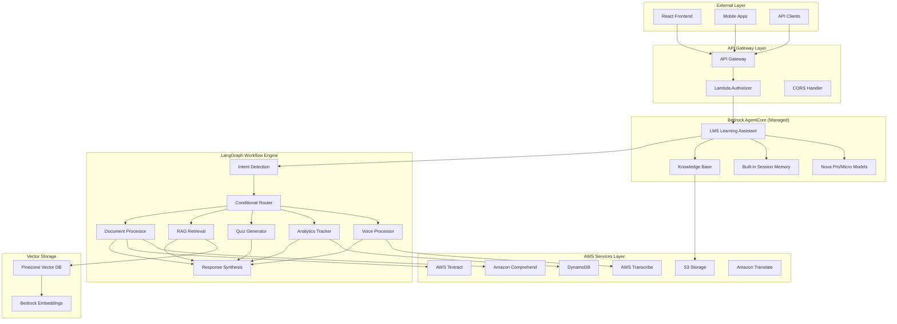
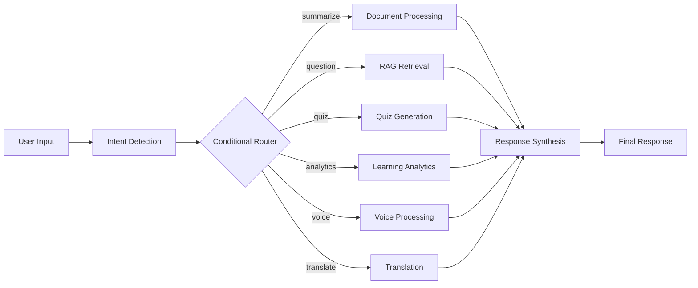
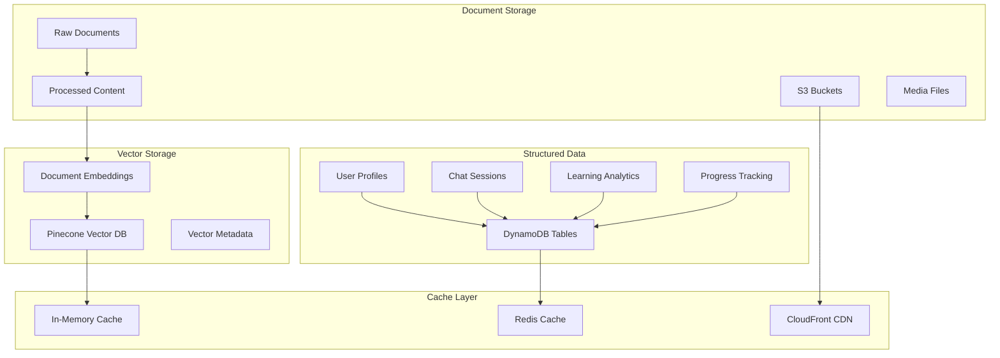
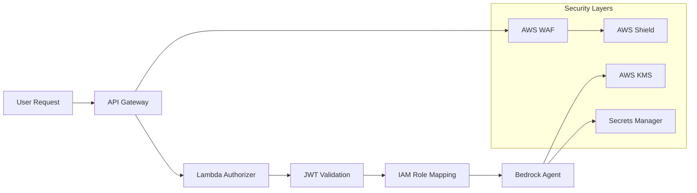
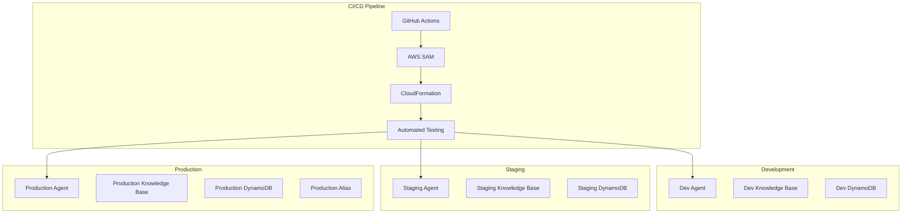
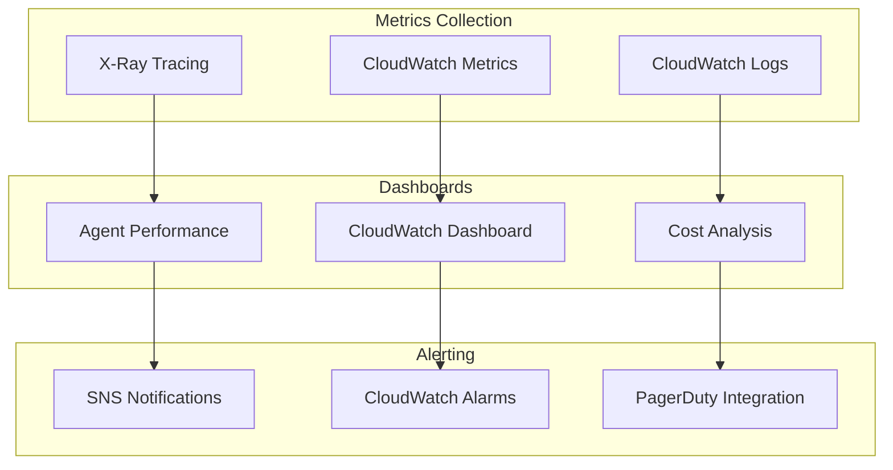
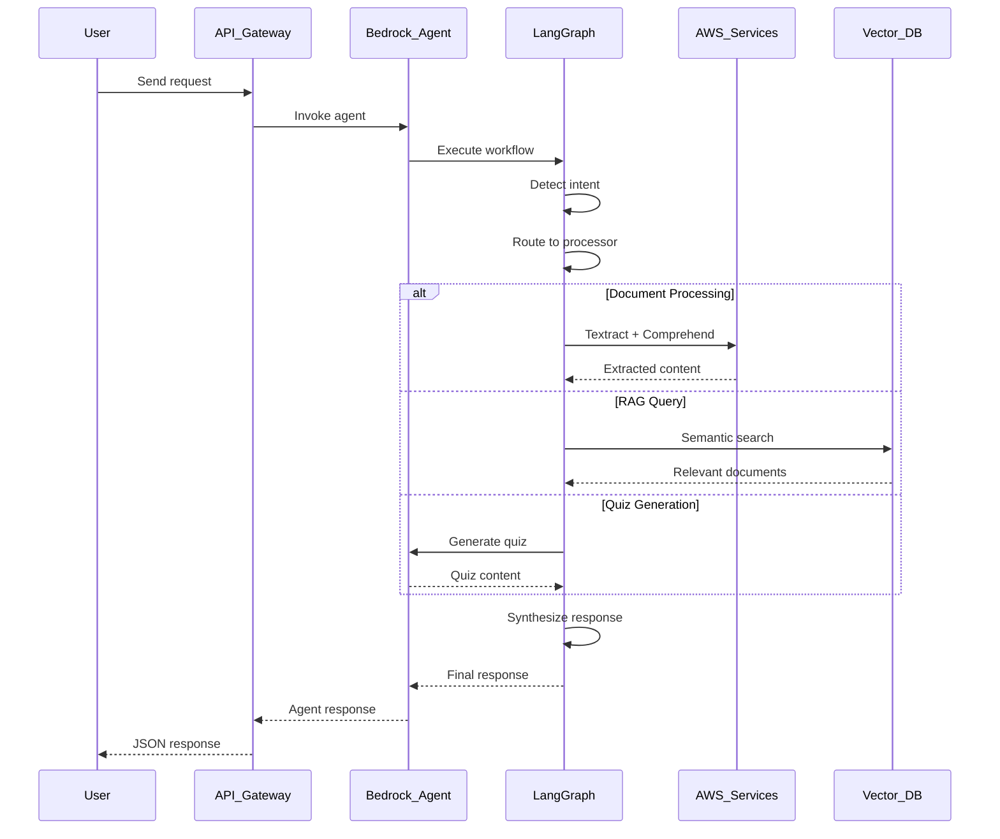

# 🏗️ LMS AI Agent - System Architecture

## 📊 Architecture Overview

The Intelligent LMS Agent implements a **hybrid Bedrock AgentCore + LangGraph architecture** that combines AWS's fully managed AI infrastructure with flexible workflow orchestration. This design provides enterprise-grade reliability while maintaining the flexibility needed for complex educational workflows.

## 🎯 Core Design Principles

### 1. **Managed-First Approach**
- **AWS Bedrock AgentCore**: Production-grade agent deployment platform
- **Managed Services**: Minimize operational overhead with AWS native services
- **Auto-Scaling**: Serverless architecture that scales with demand
- **Cost Optimization**: Pay-per-request model with intelligent resource usage

### 2. **Multi-Modal AI Integration**
- **Text Processing**: Advanced document analysis with Textract + Comprehend
- **Voice Intelligence**: Real-time speech processing with Transcribe
- **Visual Content**: Image and diagram analysis capabilities
- **Analytics Engine**: Learning progress tracking and recommendations

### 3. **Workflow-Driven Architecture**
- **LangGraph Orchestration**: Complex conditional logic and routing
- **Intent-Based Processing**: Smart routing based on user intent detection
- **Modular Components**: Loosely coupled services for maintainability
- **Event-Driven Design**: Asynchronous processing for performance

## 🏛️ High-Level Architecture



## 🤖 Bedrock AgentCore Integration

### Agent Configuration
```yaml
Agent Name: lms-learning-assistant
Foundation Model: amazon.nova-micro-v1:0 (dev) / amazon.nova-pro-v1:0 (prod)
Session TTL: 30 minutes
Memory: Built-in conversation memory + DynamoDB backup
Knowledge Base: S3-backed with Pinecone vector storage
```

### Action Groups (Lambda Functions)
1. **Document Processor** - Advanced document analysis
2. **Quiz Generator** - AI-powered assessment creation
3. **Analytics Tracker** - Learning progress monitoring
4. **Voice Processor** - Real-time speech analysis
5. **Subject Manager** - Course and assignment handling

## 🔄 LangGraph Workflow Architecture

### Workflow State Management
```python
class LMSAgentState(TypedDict):
    messages: List[BaseMessage]
    user_id: str
    session_id: str
    intent: str
    documents: List[dict]
    context: dict
    tools_used: List[str]
    final_response: str
    metadata: dict
```

### Intent Detection & Routing


### Workflow Nodes Implementation

#### 1. Intent Detection Node
- **Purpose**: Classify user intent using NLP analysis
- **Technology**: Amazon Comprehend + LLM reasoning
- **Output**: Intent classification (summarize, question, quiz, analytics, voice)

#### 2. Document Processing Node
- **Purpose**: Extract and analyze document content
- **Technology**: AWS Textract + Amazon Comprehend
- **Capabilities**: Text extraction, entity recognition, key phrase detection

#### 3. RAG Retrieval Node
- **Purpose**: Retrieve relevant context from knowledge base
- **Technology**: Pinecone vector search + Bedrock embeddings
- **Features**: Semantic search, citation tracking, relevance scoring

#### 4. Quiz Generation Node
- **Purpose**: Create personalized assessments
- **Technology**: Bedrock LLM + content analysis
- **Features**: Difficulty adjustment, multiple formats, auto-grading

#### 5. Analytics Tracking Node
- **Purpose**: Monitor learning progress and performance
- **Technology**: DynamoDB + statistical analysis
- **Features**: Progress tracking, recommendation engine, performance insights

## 💾 Data Architecture

### Storage Strategy


### Database Schema

#### DynamoDB Tables
1. **lms-users** - User profiles and preferences
2. **lms-sessions** - Chat session history and context
3. **lms-analytics** - Learning progress and performance metrics
4. **lms-subjects** - Course and subject management
5. **lms-assignments** - Assignment and quiz data

#### Pinecone Vector Index
- **Dimension**: 1536 (Bedrock Titan embeddings)
- **Metric**: Cosine similarity
- **Metadata**: Document source, timestamp, user_id, subject
- **Capacity**: 5M vectors (scalable to 100M+)

## 🔐 Security Architecture

### Authentication & Authorization


### Security Features
- **JWT Authentication**: Supabase (dev) / Cognito (prod)
- **IAM Integration**: Fine-grained permissions per user role
- **Encryption**: At-rest (KMS) and in-transit (TLS 1.3)
- **Session Isolation**: User-specific data segregation
- **API Security**: Rate limiting, CORS, input validation

## 🚀 Deployment Architecture

### Multi-Environment Strategy


### Infrastructure as Code
- **AWS SAM**: Primary deployment framework
- **CloudFormation**: Infrastructure provisioning
- **GitHub Actions**: CI/CD automation
- **Environment Separation**: Isolated stacks per environment

## 📊 Monitoring & Observability

### Monitoring Stack


### Key Metrics
- **Agent Performance**: Response time, success rate, error rate
- **Cost Tracking**: Per-request costs, monthly spend analysis
- **User Engagement**: Session duration, feature usage, satisfaction
- **System Health**: Lambda performance, DynamoDB throttling, S3 access

## 🔧 Performance Optimization

### Caching Strategy
1. **Response Caching**: Frequently accessed content
2. **Vector Caching**: Recently retrieved embeddings
3. **Session Caching**: Active conversation context
4. **CDN Caching**: Static assets and media files

### Cost Optimization
1. **Pinecone Integration**: 80% savings vs OpenSearch Serverless
2. **Model Selection**: Nova Micro (dev) vs Nova Pro (prod)
3. **Intelligent Routing**: Minimize LLM calls through smart caching
4. **Resource Scheduling**: Auto-scaling based on usage patterns

## 🔄 Data Flow Architecture

### Request Processing Flow


## 🎯 Scalability Considerations

### Horizontal Scaling
- **Serverless Architecture**: Auto-scaling Lambda functions
- **Managed Services**: Bedrock AgentCore handles scaling automatically
- **Vector Database**: Pinecone scales to billions of vectors
- **CDN Distribution**: Global content delivery

### Performance Targets
- **Response Time**: < 3 seconds for complex queries
- **Throughput**: 1000+ concurrent users
- **Availability**: 99.9% uptime SLA
- **Cost per User**: < $0.50/month at scale

## 🔮 Future Architecture Evolution

### Planned Enhancements
1. **Multi-Agent Orchestration**: Specialized agents for different subjects
2. **Real-time Collaboration**: WebSocket-based group learning
3. **Advanced Analytics**: ML-powered learning path optimization
4. **Mobile SDK**: Native mobile app integration
5. **Enterprise Features**: SSO, advanced security, compliance

### Technology Roadmap
- **Q2 2025**: Multi-agent coordination with Bedrock Flows
- **Q3 2025**: Advanced analytics with SageMaker integration
- **Q4 2025**: Real-time collaboration features
- **2026**: Enterprise-grade security and compliance features

---

This architecture provides a solid foundation for a production-ready AI learning management system that can scale to serve millions of users while maintaining cost efficiency and high performance.