# LMS AI Agent - Complete End-to-End Architecture

## 🏗️ Complete System Architecture Overview

```mermaid
graph TB
    %% External Users & Interfaces
    subgraph "👥 Users & External Access"
        Student[👨‍🎓 Students]
        Teacher[👩‍🏫 Teachers]
        Admin[👨‍💼 Administrators]
        Mobile[📱 Mobile Apps]
        WebApp[🌐 Web Applications]
        ThirdParty[🔗 Third-Party Systems]
    end
    
    %% Frontend Layer
    subgraph "🎨 Frontend Layer"
        ReactApp[⚛️ React Frontend]
        ReactApp --> AuthUI[🔐 Authentication UI]
        ReactApp --> ChatUI[💬 Chat Interface]
        ReactApp --> FileUI[📁 File Upload UI]
        ReactApp --> QuizUI[❓ Quiz Interface]
        ReactApp --> AnalyticsUI[📊 Analytics Dashboard]
        ReactApp --> VoiceUI[🎤 Voice Interview UI]
    end
    
    %% API Gateway Layer
    subgraph "🌐 API Gateway Layer"
        APIGateway[🚪 AWS API Gateway]
        APIGateway --> RESTEndpoints[🔗 REST Endpoints]
        APIGateway --> WebSocketAPI[🔌 WebSocket API]
        APIGateway --> CORSConfig[🌍 CORS Configuration]
    end
    
    %% Authentication & Authorization
    subgraph "🔐 Authentication & Authorization"
        LambdaAuth[⚡ Lambda Authorizer]
        Supabase[🔑 Supabase Auth<br/>Development]
        Cognito[👥 AWS Cognito<br/>Production]
        IAMRoles[🛡️ IAM Roles & Policies]
    end
    
    %% Core AI Agent System
    subgraph "🤖 Bedrock AgentCore System"
        BedrockAgent[🧠 Bedrock Agent<br/>Production Alias]
        AgentMemory[💾 Built-in Session Memory]
        AgentInstructions[📋 Agent Instructions<br/>& Configuration]
        FoundationModel[🎯 Foundation Model<br/>Amazon Nova Pro/Micro]
    end
    
    %% Knowledge Base System
    subgraph "📚 Knowledge Base System"
        BedrockKB[📖 Bedrock Knowledge Base]
        S3DataSource[📂 S3 Data Source]
        PineconeVector[🔍 Pinecone Vector Store<br/>Cost-Effective]
        EmbeddingModel[🧮 Amazon Titan<br/>Embeddings]
    end
    
    %% LangGraph Workflow Engine
    subgraph "🔄 LangGraph Workflow Engine"
        LangGraphExecutor[⚡ LangGraph Executor Lambda]
        WorkflowState[📊 Workflow State Management]
        
        subgraph "🎯 Intent Detection & Routing"
            IntentDetection[🎯 Intent Detection Node]
            ConditionalRouter[🔀 Conditional Router]
        end
        
        subgraph "📄 Document Processing Branch"
            DocProcessor[📝 Document Processor]
            TextractService[📄 AWS Textract]
            ComprehendDoc[🧠 Comprehend Analysis]
            DocumentSummary[📋 Document Summary]
        end
        
        subgraph "🔍 RAG Retrieval Branch"
            RAGRetriever[🔎 RAG Retriever]
            ContextRetrieval[📚 Context Retrieval]
            RAGResponse[💬 RAG Response]
        end
        
        subgraph "❓ Quiz Generation Branch"
            QuizGenerator[❓ Quiz Generator]
            ContentAnalysis[📖 Content Analysis]
            QuizStorage[💾 Quiz Storage]
        end
        
        subgraph "📊 Analytics Branch"
            AnalyticsTracker[📈 Analytics Tracker]
            ProgressCalculation[📊 Progress Calculation]
            SentimentAnalysis[😊 Sentiment Analysis]
            Recommendations[🎯 Recommendations]
        end
        
        subgraph "🎤 Voice Processing Branch"
            VoiceProcessor[🎙️ Voice Processor]
            TranscribeStream[🎵 Transcribe Streaming]
            VoiceAnalysis[🗣️ Voice Analysis]
            InterviewFeedback[📝 Interview Feedback]
        end
        
        subgraph "🌍 Multi-Language Support"
            LanguageDetection[🗣️ Language Detection]
            TranslationService[🌐 Amazon Translate]
            MultiLangResponse[🌍 Multi-Language Response]
        end
        
        ResponseSynthesis[✨ Response Synthesis]
    end
    
    %% Action Groups (Lambda Functions)
    subgraph "⚡ Lambda Action Groups"
        DocumentActionGroup[📄 Document Action Group]
        QuizActionGroup[❓ Quiz Action Group]
        AnalyticsActionGroup[📊 Analytics Action Group]
        VoiceActionGroup[🎤 Voice Action Group]
        SubjectActionGroup[📚 Subject Action Group]
    end
    
    %% AWS AI Services
    subgraph "🧠 AWS AI Services"
        BedrockLLM[🤖 Bedrock LLM<br/>Claude 3 Sonnet/Nova]
        Textract[📝 AWS Textract<br/>Document Analysis]
        Comprehend[🧠 Amazon Comprehend<br/>NLP & Sentiment]
        Translate[🌍 Amazon Translate<br/>Multi-Language]
        Transcribe[🎙️ AWS Transcribe<br/>Speech-to-Text]
        Polly[🔊 Amazon Polly<br/>Text-to-Speech]
    end
    
    %% Data Storage Layer
    subgraph "🗄️ Data Storage Layer"
        S3Documents[📁 S3 Document Storage]
        DynamoDBTables[🗃️ DynamoDB Tables]
        
        subgraph "📊 DynamoDB Tables"
            ChatMemory[💬 Chat Memory Table]
            QuizData[❓ Quiz Data Table]
            AnalyticsData[📈 Analytics Data Table]
            UserProgress[👤 User Progress Table]
            Transcripts[📝 Transcripts Table]
            SubjectData[📚 Subject Data Table]
            AssignmentData[📋 Assignment Data Table]
        end
    end
    
    %% External Services
    subgraph "🔗 External Services"
        PineconeAPI[🔍 Pinecone API<br/>Vector Storage]
        SecretsManager[🔐 AWS Secrets Manager]
        ParameterStore[⚙️ Parameter Store]
    end
    
    %% Monitoring & Logging
    subgraph "📊 Monitoring & Observability"
        CloudWatch[📊 CloudWatch<br/>Logs & Metrics]
        XRayTracing[🔍 X-Ray Tracing]
        CloudWatchDashboards[📈 CloudWatch Dashboards]
        CloudWatchAlarms[🚨 CloudWatch Alarms]
    end
    
    %% Infrastructure as Code
    subgraph "🛠️ Infrastructure as Code"
        SAMTemplate[📋 AWS SAM Template]
        CloudFormation[☁️ CloudFormation Stacks]
        GitHubActions[🔄 GitHub Actions CI/CD]
    end
    
    %% Connections - User Flow
    Student --> ReactApp
    Teacher --> ReactApp
    Admin --> ReactApp
    Mobile --> APIGateway
    WebApp --> APIGateway
    ThirdParty --> APIGateway
    
    ReactApp --> APIGateway
    
    %% API Gateway Routing
    APIGateway --> LambdaAuth
    LambdaAuth --> Supabase
    LambdaAuth --> Cognito
    LambdaAuth --> IAMRoles
    
    APIGateway --> BedrockAgent
    
    %% Bedrock Agent Core
    BedrockAgent --> AgentMemory
    BedrockAgent --> AgentInstructions
    BedrockAgent --> FoundationModel
    BedrockAgent --> BedrockKB
    
    %% Knowledge Base Flow
    BedrockKB --> S3DataSource
    BedrockKB --> PineconeVector
    BedrockKB --> EmbeddingModel
    
    %% Agent to LangGraph
    BedrockAgent --> LangGraphExecutor
    LangGraphExecutor --> WorkflowState
    
    %% Intent Detection Flow
    WorkflowState --> IntentDetection
    IntentDetection --> ConditionalRouter
    
    %% Conditional Routing
    ConditionalRouter -->|summarize| DocProcessor
    ConditionalRouter -->|question| RAGRetriever
    ConditionalRouter -->|quiz| QuizGenerator
    ConditionalRouter -->|analytics| AnalyticsTracker
    ConditionalRouter -->|voice| VoiceProcessor
    
    %% Document Processing Flow
    DocProcessor --> TextractService
    DocProcessor --> ComprehendDoc
    TextractService --> DocumentSummary
    ComprehendDoc --> DocumentSummary
    
    %% RAG Flow
    RAGRetriever --> ContextRetrieval
    ContextRetrieval --> BedrockKB
    ContextRetrieval --> RAGResponse
    
    %% Quiz Flow
    QuizGenerator --> ContentAnalysis
    ContentAnalysis --> QuizStorage
    QuizStorage --> DynamoDBTables
    
    %% Analytics Flow
    AnalyticsTracker --> ProgressCalculation
    ProgressCalculation --> SentimentAnalysis
    SentimentAnalysis --> Recommendations
    
    %% Voice Flow
    VoiceProcessor --> TranscribeStream
    TranscribeStream --> VoiceAnalysis
    VoiceAnalysis --> InterviewFeedback
    
    %% Multi-Language Flow
    DocumentSummary --> LanguageDetection
    RAGResponse --> LanguageDetection
    QuizStorage --> LanguageDetection
    Recommendations --> LanguageDetection
    InterviewFeedback --> LanguageDetection
    
    LanguageDetection --> TranslationService
    TranslationService --> MultiLangResponse
    MultiLangResponse --> ResponseSynthesis
    
    %% Response Synthesis
    ResponseSynthesis --> BedrockAgent
    
    %% Action Groups Integration
    LangGraphExecutor --> DocumentActionGroup
    LangGraphExecutor --> QuizActionGroup
    LangGraphExecutor --> AnalyticsActionGroup
    LangGraphExecutor --> VoiceActionGroup
    LangGraphExecutor --> SubjectActionGroup
    
    %% AWS Services Integration
    DocumentActionGroup --> Textract
    DocumentActionGroup --> Comprehend
    QuizActionGroup --> BedrockLLM
    AnalyticsActionGroup --> Comprehend
    VoiceActionGroup --> Transcribe
    VoiceActionGroup --> Polly
    
    %% Data Storage Connections
    DocumentActionGroup --> S3Documents
    QuizActionGroup --> QuizData
    AnalyticsActionGroup --> AnalyticsData
    VoiceActionGroup --> Transcripts
    SubjectActionGroup --> SubjectData
    SubjectActionGroup --> AssignmentData
    
    BedrockAgent --> ChatMemory
    AnalyticsActionGroup --> UserProgress
    
    %% External Services
    BedrockKB --> PineconeAPI
    LambdaAuth --> SecretsManager
    DocumentActionGroup --> ParameterStore
    
    %% Monitoring Connections
    BedrockAgent --> CloudWatch
    LangGraphExecutor --> CloudWatch
    DocumentActionGroup --> XRayTracing
    QuizActionGroup --> XRayTracing
    AnalyticsActionGroup --> XRayTracing
    VoiceActionGroup --> XRayTracing
    
    CloudWatch --> CloudWatchDashboards
    CloudWatch --> CloudWatchAlarms
    
    %% Infrastructure Deployment
    SAMTemplate --> CloudFormation
    GitHubActions --> SAMTemplate
    CloudFormation --> BedrockAgent
    CloudFormation --> LangGraphExecutor
    CloudFormation --> DynamoDBTables
    CloudFormation --> S3Documents
    
    %% Styling
    classDef userLayer fill:#e1f5fe,stroke:#01579b,stroke-width:2px
    classDef frontendLayer fill:#f3e5f5,stroke:#4a148c,stroke-width:2px
    classDef apiLayer fill:#e8f5e8,stroke:#1b5e20,stroke-width:2px
    classDef authLayer fill:#fff3e0,stroke:#e65100,stroke-width:2px
    classDef agentLayer fill:#e0f2f1,stroke:#004d40,stroke-width:2px
    classDef workflowLayer fill:#fce4ec,stroke:#880e4f,stroke-width:2px
    classDef awsServices fill:#f1f8e9,stroke:#33691e,stroke-width:2px
    classDef storageLayer fill:#f9fbe7,stroke:#827717,stroke-width:2px
    classDef externalLayer fill:#fff8e1,stroke:#ff6f00,stroke-width:2px
    classDef monitoringLayer fill:#f3e5f5,stroke:#6a1b9a,stroke-width:2px
    classDef infraLayer fill:#e8eaf6,stroke:#283593,stroke-width:2px
    
    class Student,Teacher,Admin,Mobile,WebApp,ThirdParty userLayer
    class ReactApp,AuthUI,ChatUI,FileUI,QuizUI,AnalyticsUI,VoiceUI frontendLayer
    class APIGateway,RESTEndpoints,WebSocketAPI,CORSConfig apiLayer
    class LambdaAuth,Supabase,Cognito,IAMRoles authLayer
    class BedrockAgent,AgentMemory,AgentInstructions,FoundationModel,BedrockKB,S3DataSource,PineconeVector,EmbeddingModel agentLayer
    class LangGraphExecutor,WorkflowState,IntentDetection,ConditionalRouter,DocProcessor,RAGRetriever,QuizGenerator,AnalyticsTracker,VoiceProcessor,ResponseSynthesis,DocumentActionGroup,QuizActionGroup,AnalyticsActionGroup,VoiceActionGroup,SubjectActionGroup workflowLayer
    class BedrockLLM,Textract,Comprehend,Translate,Transcribe,Polly,TextractService,ComprehendDoc,TranscribeStream,LanguageDetection,TranslationService awsServices
    class S3Documents,DynamoDBTables,ChatMemory,QuizData,AnalyticsData,UserProgress,Transcripts,SubjectData,AssignmentData storageLayer
    class PineconeAPI,SecretsManager,ParameterStore externalLayer
    class CloudWatch,XRayTracing,CloudWatchDashboards,CloudWatchAlarms monitoringLayer
    class SAMTemplate,CloudFormation,GitHubActions infraLayer
```

## 🔄 Detailed LangGraph Workflow Architecture

```mermaid
graph TB
    %% Input Processing
    subgraph "📥 Input Processing Layer"
        UserInput[👤 User Input<br/>Text/Voice/File]
        InputValidation[✅ Input Validation]
        StateInitialization[📊 State Initialization]
    end
    
    %% Core Workflow State
    subgraph "🧠 LangGraph Workflow State"
        AgentState[📋 Agent State]
        AgentState --> Messages[💬 Messages History]
        AgentState --> UserContext[👤 User Context]
        AgentState --> DocumentContext[📄 Document Context]
        AgentState --> IntentData[🎯 Intent Data]
        AgentState --> ToolsUsed[🛠️ Tools Used]
        AgentState --> WorkflowMetadata[📊 Workflow Metadata]
    end
    
    %% Intent Detection System
    subgraph "🎯 Intent Detection & Classification"
        IntentClassifier[🧠 Intent Classifier<br/>Comprehend + LLM]
        IntentCategories[📋 Intent Categories]
        IntentCategories --> SummarizeIntent[📄 Summarize Intent]
        IntentCategories --> QuestionIntent[❓ Question Intent]
        IntentCategories --> QuizIntent[🎯 Quiz Intent]
        IntentCategories --> AnalyticsIntent[📊 Analytics Intent]
        IntentCategories --> VoiceIntent[🎤 Voice Intent]
        IntentCategories --> TranslateIntent[🌍 Translate Intent]
        IntentCategories --> SubjectIntent[📚 Subject Intent]
    end
    
    %% Conditional Routing Engine
    subgraph "🔀 Conditional Routing Engine"
        RouterLogic[🔀 Router Logic]
        RoutingDecision{🎯 Routing Decision}
    end
    
    %% Document Processing Workflow
    subgraph "📄 Document Processing Workflow"
        DocumentNode[📝 Document Processing Node]
        
        subgraph "📄 Document Analysis Pipeline"
            FileTypeDetection[📋 File Type Detection]
            TextractExtraction[📝 Textract Extraction]
            ComprehendAnalysis[🧠 Comprehend Analysis]
            EntityExtraction[🏷️ Entity Extraction]
            KeyPhraseExtraction[🔑 Key Phrase Extraction]
            SentimentAnalysis[😊 Sentiment Analysis]
        end
        
        subgraph "📊 Document Processing Results"
            ExtractedText[📝 Extracted Text]
            DocumentEntities[🏷️ Document Entities]
            DocumentSentiment[😊 Document Sentiment]
            DocumentSummary[📋 Document Summary]
        end
    end
    
    %% RAG Retrieval Workflow
    subgraph "🔍 RAG Retrieval Workflow"
        RAGNode[🔎 RAG Processing Node]
        
        subgraph "🔍 Knowledge Base Retrieval"
            QueryProcessing[🔍 Query Processing]
            VectorSearch[🧮 Vector Search]
            ContextRanking[📊 Context Ranking]
            RelevanceFiltering[🎯 Relevance Filtering]
        end
        
        subgraph "📚 Knowledge Base Integration"
            BedrockKBQuery[📖 Bedrock KB Query]
            PineconeSearch[🔍 Pinecone Search]
            S3DocumentRetrieval[📂 S3 Document Retrieval]
            ContextAggregation[📊 Context Aggregation]
        end
        
        subgraph "💬 RAG Response Generation"
            ContextualResponse[💬 Contextual Response]
            CitationGeneration[📎 Citation Generation]
            ConfidenceScoring[📊 Confidence Scoring]
        end
    end
    
    %% Quiz Generation Workflow
    subgraph "❓ Quiz Generation Workflow"
        QuizNode[🎯 Quiz Generation Node]
        
        subgraph "📖 Content Analysis"
            ContentExtraction[📖 Content Extraction]
            TopicIdentification[🏷️ Topic Identification]
            DifficultyAssessment[📊 Difficulty Assessment]
            LearningObjectives[🎯 Learning Objectives]
        end
        
        subgraph "❓ Question Generation"
            QuestionTypes[❓ Question Types]
            QuestionTypes --> MultipleChoice[☑️ Multiple Choice]
            QuestionTypes --> TrueFalse[✅ True/False]
            QuestionTypes --> ShortAnswer[📝 Short Answer]
            QuestionTypes --> Essay[📄 Essay Questions]
        end
        
        subgraph "💾 Quiz Management"
            QuizValidation[✅ Quiz Validation]
            QuizStorage[💾 Quiz Storage]
            QuizMetadata[📊 Quiz Metadata]
        end
    end
    
    %% Analytics Workflow
    subgraph "📊 Analytics & Progress Tracking"
        AnalyticsNode[📈 Analytics Processing Node]
        
        subgraph "📊 Learning Analytics"
            ProgressCalculation[📈 Progress Calculation]
            ConceptMastery[🎯 Concept Mastery]
            LearningPatterns[🔄 Learning Patterns]
            PerformanceMetrics[📊 Performance Metrics]
        end
        
        subgraph "🎯 Personalization Engine"
            RecommendationEngine[🎯 Recommendation Engine]
            AdaptiveLearning[🔄 Adaptive Learning]
            PersonalizedContent[👤 Personalized Content]
            LearningPathOptimization[🛤️ Learning Path Optimization]
        end
        
        subgraph "👩‍🏫 Teacher Analytics"
            ClassroomInsights[👥 Classroom Insights]
            StudentProgressSummary[📊 Student Progress Summary]
            CurriculumEffectiveness[📚 Curriculum Effectiveness]
            InterventionRecommendations[🎯 Intervention Recommendations]
        end
    end
    
    %% Voice Processing Workflow
    subgraph "🎤 Voice Processing Workflow"
        VoiceNode[🎙️ Voice Processing Node]
        
        subgraph "🎵 Audio Processing Pipeline"
            AudioValidation[✅ Audio Validation]
            TranscribeStreaming[🎵 Transcribe Streaming]
            SpeechToText[📝 Speech-to-Text]
            AudioQualityAnalysis[📊 Audio Quality Analysis]
        end
        
        subgraph "🗣️ Voice Analysis"
            SpeechPatternAnalysis[🗣️ Speech Pattern Analysis]
            FluentAnalysis[🎯 Fluency Analysis]
            PronunciationAssessment[🔤 Pronunciation Assessment]
            ConfidenceDetection[😊 Confidence Detection]
        end
        
        subgraph "🎤 Interview Management"
            InterviewSession[🎤 Interview Session]
            QuestionGeneration[❓ Question Generation]
            ResponseEvaluation[📊 Response Evaluation]
            FeedbackGeneration[📝 Feedback Generation]
        end
    end
    
    %% Multi-Language Support
    subgraph "🌍 Multi-Language Processing"
        LanguageNode[🌐 Language Processing Node]
        
        subgraph "🗣️ Language Detection"
            LanguageIdentification[🗣️ Language Identification]
            ConfidenceScoring[📊 Confidence Scoring]
            LanguageValidation[✅ Language Validation]
        end
        
        subgraph "🔄 Translation Pipeline"
            SourceLanguageDetection[🔍 Source Language Detection]
            TranslationExecution[🔄 Translation Execution]
            QualityAssessment[📊 Quality Assessment]
            BackTranslation[🔄 Back Translation]
        end
        
        subgraph "🌍 Localization"
            CulturalAdaptation[🌍 Cultural Adaptation]
            RegionalCustomization[🗺️ Regional Customization]
            LocalizedContent[📝 Localized Content]
        end
    end
    
    %% Response Synthesis Engine
    subgraph "✨ Response Synthesis Engine"
        SynthesisNode[✨ Response Synthesis Node]
        
        subgraph "🧠 Response Generation"
            ContentAggregation[📊 Content Aggregation]
            ResponsePlanning[📋 Response Planning]
            LLMGeneration[🤖 LLM Generation]
            ResponseValidation[✅ Response Validation]
        end
        
        subgraph "🎨 Response Formatting"
            MarkdownFormatting[📝 Markdown Formatting]
            CitationFormatting[📎 Citation Formatting]
            MediaIntegration[🖼️ Media Integration]
            InteractiveElements[🎮 Interactive Elements]
        end
        
        subgraph "📊 Response Enhancement"
            ContextualEnrichment[📊 Contextual Enrichment]
            PersonalizationLayer[👤 Personalization Layer]
            AccessibilityFeatures[♿ Accessibility Features]
            QualityAssurance[✅ Quality Assurance]
        end
    end
    
    %% Memory Management
    subgraph "💾 Memory & State Management"
        MemoryNode[💾 Memory Management Node]
        
        subgraph "💬 Conversation Memory"
            ShortTermMemory[⚡ Short-term Memory]
            LongTermMemory[🧠 Long-term Memory]
            ConversationHistory[💬 Conversation History]
            ContextWindow[🪟 Context Window]
        end
        
        subgraph "👤 User Context"
            UserProfile[👤 User Profile]
            LearningPreferences[🎯 Learning Preferences]
            ProgressHistory[📊 Progress History]
            PersonalizationData[👤 Personalization Data]
        end
        
        subgraph "📊 Session Management"
            SessionState[📊 Session State]
            WorkflowProgress[🔄 Workflow Progress]
            ErrorRecovery[🔧 Error Recovery]
            StateValidation[✅ State Validation]
        end
    end
    
    %% Workflow Connections
    UserInput --> InputValidation
    InputValidation --> StateInitialization
    StateInitialization --> AgentState
    
    AgentState --> IntentClassifier
    IntentClassifier --> IntentCategories
    IntentCategories --> RouterLogic
    RouterLogic --> RoutingDecision
    
    %% Routing Decisions
    RoutingDecision -->|summarize| DocumentNode
    RoutingDecision -->|question| RAGNode
    RoutingDecision -->|quiz| QuizNode
    RoutingDecision -->|analytics| AnalyticsNode
    RoutingDecision -->|voice| VoiceNode
    RoutingDecision -->|translate| LanguageNode
    
    %% Document Processing Flow
    DocumentNode --> FileTypeDetection
    FileTypeDetection --> TextractExtraction
    TextractExtraction --> ComprehendAnalysis
    ComprehendAnalysis --> EntityExtraction
    ComprehendAnalysis --> KeyPhraseExtraction
    ComprehendAnalysis --> SentimentAnalysis
    
    EntityExtraction --> ExtractedText
    KeyPhraseExtraction --> DocumentEntities
    SentimentAnalysis --> DocumentSentiment
    ExtractedText --> DocumentSummary
    
    %% RAG Processing Flow
    RAGNode --> QueryProcessing
    QueryProcessing --> VectorSearch
    VectorSearch --> BedrockKBQuery
    BedrockKBQuery --> PineconeSearch
    PineconeSearch --> S3DocumentRetrieval
    S3DocumentRetrieval --> ContextAggregation
    ContextAggregation --> ContextRanking
    ContextRanking --> RelevanceFiltering
    RelevanceFiltering --> ContextualResponse
    ContextualResponse --> CitationGeneration
    CitationGeneration --> ConfidenceScoring
    
    %% Quiz Generation Flow
    QuizNode --> ContentExtraction
    ContentExtraction --> TopicIdentification
    TopicIdentification --> DifficultyAssessment
    DifficultyAssessment --> LearningObjectives
    LearningObjectives --> QuestionTypes
    QuestionTypes --> QuizValidation
    QuizValidation --> QuizStorage
    QuizStorage --> QuizMetadata
    
    %% Analytics Flow
    AnalyticsNode --> ProgressCalculation
    ProgressCalculation --> ConceptMastery
    ConceptMastery --> LearningPatterns
    LearningPatterns --> PerformanceMetrics
    PerformanceMetrics --> RecommendationEngine
    RecommendationEngine --> AdaptiveLearning
    AdaptiveLearning --> PersonalizedContent
    PersonalizedContent --> LearningPathOptimization
    
    %% Voice Processing Flow
    VoiceNode --> AudioValidation
    AudioValidation --> TranscribeStreaming
    TranscribeStreaming --> SpeechToText
    SpeechToText --> SpeechPatternAnalysis
    SpeechPatternAnalysis --> FluentAnalysis
    FluentAnalysis --> PronunciationAssessment
    PronunciationAssessment --> ConfidenceDetection
    ConfidenceDetection --> InterviewSession
    InterviewSession --> QuestionGeneration
    QuestionGeneration --> ResponseEvaluation
    ResponseEvaluation --> FeedbackGeneration
    
    %% Language Processing Flow
    LanguageNode --> LanguageIdentification
    LanguageIdentification --> ConfidenceScoring
    ConfidenceScoring --> LanguageValidation
    LanguageValidation --> SourceLanguageDetection
    SourceLanguageDetection --> TranslationExecution
    TranslationExecution --> QualityAssessment
    QualityAssessment --> BackTranslation
    BackTranslation --> CulturalAdaptation
    CulturalAdaptation --> RegionalCustomization
    RegionalCustomization --> LocalizedContent
    
    %% Convergence to Response Synthesis
    DocumentSummary --> SynthesisNode
    ConfidenceScoring --> SynthesisNode
    QuizMetadata --> SynthesisNode
    LearningPathOptimization --> SynthesisNode
    FeedbackGeneration --> SynthesisNode
    LocalizedContent --> SynthesisNode
    
    %% Response Synthesis Flow
    SynthesisNode --> ContentAggregation
    ContentAggregation --> ResponsePlanning
    ResponsePlanning --> LLMGeneration
    LLMGeneration --> ResponseValidation
    ResponseValidation --> MarkdownFormatting
    MarkdownFormatting --> CitationFormatting
    CitationFormatting --> MediaIntegration
    MediaIntegration --> InteractiveElements
    InteractiveElements --> ContextualEnrichment
    ContextualEnrichment --> PersonalizationLayer
    PersonalizationLayer --> AccessibilityFeatures
    AccessibilityFeatures --> QualityAssurance
    
    %% Memory Management Integration
    AgentState --> MemoryNode
    SynthesisNode --> MemoryNode
    MemoryNode --> ShortTermMemory
    MemoryNode --> LongTermMemory
    MemoryNode --> ConversationHistory
    MemoryNode --> UserProfile
    MemoryNode --> SessionState
    
    %% Final Output
    QualityAssurance --> FinalOutput[📤 Final Response Output]
    MemoryNode --> FinalOutput
    
    %% Styling
    classDef inputLayer fill:#e3f2fd,stroke:#0277bd,stroke-width:2px
    classDef stateLayer fill:#f1f8e9,stroke:#388e3c,stroke-width:2px
    classDef intentLayer fill:#fff3e0,stroke:#f57c00,stroke-width:2px
    classDef routingLayer fill:#fce4ec,stroke:#c2185b,stroke-width:2px
    classDef processingLayer fill:#e8f5e8,stroke:#2e7d32,stroke-width:2px
    classDef synthesisLayer fill:#f3e5f5,stroke:#7b1fa2,stroke-width:2px
    classDef memoryLayer fill:#e0f2f1,stroke:#00695c,stroke-width:2px
    classDef outputLayer fill:#fff8e1,stroke:#ff8f00,stroke-width:2px
    
    class UserInput,InputValidation,StateInitialization inputLayer
    class AgentState,Messages,UserContext,DocumentContext,IntentData,ToolsUsed,WorkflowMetadata stateLayer
    class IntentClassifier,IntentCategories,SummarizeIntent,QuestionIntent,QuizIntent,AnalyticsIntent,VoiceIntent,TranslateIntent,SubjectIntent intentLayer
    class RouterLogic,RoutingDecision routingLayer
    class DocumentNode,RAGNode,QuizNode,AnalyticsNode,VoiceNode,LanguageNode processingLayer
    class SynthesisNode,ContentAggregation,ResponsePlanning,LLMGeneration,ResponseValidation synthesisLayer
    class MemoryNode,ShortTermMemory,LongTermMemory,ConversationHistory,UserProfile,SessionState memoryLayer
    class FinalOutput outputLayer
```

## 🚀 Deployment & Infrastructure Flow

```mermaid
graph TB
    %% Development Environment
    subgraph "👨‍💻 Development Environment"
        Developer[👨‍💻 Developer]
        LocalDev[💻 Local Development]
        VSCode[📝 VS Code / Kiro IDE]
        LocalTesting[🧪 Local Testing]
    end
    
    %% Source Control
    subgraph "📚 Source Control & CI/CD"
        GitHubRepo[📚 GitHub Repository]
        GitHubActions[🔄 GitHub Actions]
        CodeReview[👀 Code Review]
        AutomatedTesting[🤖 Automated Testing]
    end
    
    %% Infrastructure as Code
    subgraph "🛠️ Infrastructure as Code"
        SAMTemplate[📋 AWS SAM Template]
        CloudFormationStack[☁️ CloudFormation Stack]
        ParameterStore[⚙️ Parameter Store]
        SecretsManager[🔐 Secrets Manager]
    end
    
    %% Build & Package
    subgraph "📦 Build & Package"
        SAMBuild[🔨 sam build]
        LambdaPackaging[📦 Lambda Packaging]
        DependencyManagement[📚 Dependency Management]
        LayerCreation[🍰 Layer Creation]
    end
    
    %% Deployment Environments
    subgraph "🌍 Deployment Environments"
        DevEnvironment[🧪 Development Environment]
        StagingEnvironment[🎭 Staging Environment]
        ProductionEnvironment[🚀 Production Environment]
    end
    
    %% AWS Services Deployment
    subgraph "☁️ AWS Services Deployment"
        BedrockAgentDeploy[🤖 Bedrock Agent Deployment]
        LambdaDeploy[⚡ Lambda Functions Deployment]
        APIGatewayDeploy[🌐 API Gateway Deployment]
        DynamoDBDeploy[🗄️ DynamoDB Tables Deployment]
        S3Deploy[📁 S3 Buckets Deployment]
        IAMDeploy[🔐 IAM Roles Deployment]
    end
    
    %% Bedrock Agent Configuration
    subgraph "🤖 Bedrock Agent Configuration"
        AgentCreation[🤖 Agent Creation]
        KnowledgeBaseSetup[📚 Knowledge Base Setup]
        ActionGroupConfig[⚡ Action Group Configuration]
        AgentVersioning[📦 Agent Versioning]
        ProductionAlias[🏷️ Production Alias]
    end
    
    %% External Services Setup
    subgraph "🔗 External Services Setup"
        PineconeSetup[🔍 Pinecone Setup]
        SupabaseConfig[🔑 Supabase Configuration]
        CognitoSetup[👥 Cognito Setup]
        ExternalAPIKeys[🔑 External API Keys]
    end
    
    %% Testing & Validation
    subgraph "🧪 Testing & Validation"
        UnitTests[🔬 Unit Tests]
        IntegrationTests[🔗 Integration Tests]
        E2ETests[🎯 End-to-End Tests]
        PerformanceTests[⚡ Performance Tests]
        SecurityTests[🔐 Security Tests]
    end
    
    %% Monitoring & Observability Setup
    subgraph "📊 Monitoring & Observability"
        CloudWatchSetup[📊 CloudWatch Setup]
        DashboardCreation[📈 Dashboard Creation]
        AlarmConfiguration[🚨 Alarm Configuration]
        XRaySetup[🔍 X-Ray Tracing Setup]
        LoggingConfiguration[📝 Logging Configuration]
    end
    
    %% Post-Deployment Validation
    subgraph "✅ Post-Deployment Validation"
        HealthChecks[❤️ Health Checks]
        SmokeTests[💨 Smoke Tests]
        BedrockAgentTesting[🤖 Bedrock Agent Testing]
        APIEndpointTesting[🌐 API Endpoint Testing]
        DatabaseConnectivity[🗄️ Database Connectivity]
    end
    
    %% Rollback & Recovery
    subgraph "🔄 Rollback & Recovery"
        RollbackStrategy[🔄 Rollback Strategy]
        BackupValidation[💾 Backup Validation]
        DisasterRecovery[🆘 Disaster Recovery]
        FailoverTesting[🔄 Failover Testing]
    end
    
    %% Deployment Flow Connections
    Developer --> LocalDev
    LocalDev --> VSCode
    VSCode --> LocalTesting
    LocalTesting --> GitHubRepo
    
    GitHubRepo --> GitHubActions
    GitHubActions --> CodeReview
    CodeReview --> AutomatedTesting
    AutomatedTesting --> SAMTemplate
    
    SAMTemplate --> CloudFormationStack
    CloudFormationStack --> ParameterStore
    CloudFormationStack --> SecretsManager
    
    SAMTemplate --> SAMBuild
    SAMBuild --> LambdaPackaging
    LambdaPackaging --> DependencyManagement
    DependencyManagement --> LayerCreation
    
    LayerCreation --> DevEnvironment
    DevEnvironment --> StagingEnvironment
    StagingEnvironment --> ProductionEnvironment
    
    %% AWS Services Deployment Flow
    ProductionEnvironment --> BedrockAgentDeploy
    ProductionEnvironment --> LambdaDeploy
    ProductionEnvironment --> APIGatewayDeploy
    ProductionEnvironment --> DynamoDBDeploy
    ProductionEnvironment --> S3Deploy
    ProductionEnvironment --> IAMDeploy
    
    %% Bedrock Agent Configuration Flow
    BedrockAgentDeploy --> AgentCreation
    AgentCreation --> KnowledgeBaseSetup
    KnowledgeBaseSetup --> ActionGroupConfig
    ActionGroupConfig --> AgentVersioning
    AgentVersioning --> ProductionAlias
    
    %% External Services Flow
    ProductionEnvironment --> PineconeSetup
    ProductionEnvironment --> SupabaseConfig
    ProductionEnvironment --> CognitoSetup
    ProductionEnvironment --> ExternalAPIKeys
    
    %% Testing Flow
    ProductionAlias --> UnitTests
    UnitTests --> IntegrationTests
    IntegrationTests --> E2ETests
    E2ETests --> PerformanceTests
    PerformanceTests --> SecurityTests
    
    %% Monitoring Setup Flow
    SecurityTests --> CloudWatchSetup
    CloudWatchSetup --> DashboardCreation
    DashboardCreation --> AlarmConfiguration
    AlarmConfiguration --> XRaySetup
    XRaySetup --> LoggingConfiguration
    
    %% Validation Flow
    LoggingConfiguration --> HealthChecks
    HealthChecks --> SmokeTests
    SmokeTests --> BedrockAgentTesting
    BedrockAgentTesting --> APIEndpointTesting
    APIEndpointTesting --> DatabaseConnectivity
    
    %% Recovery Setup
    DatabaseConnectivity --> RollbackStrategy
    RollbackStrategy --> BackupValidation
    BackupValidation --> DisasterRecovery
    DisasterRecovery --> FailoverTesting
    
    %% Final Deployment Success
    FailoverTesting --> DeploymentSuccess[✅ Deployment Success<br/>Production Ready]
    
    %% Styling
    classDef devLayer fill:#e3f2fd,stroke:#0277bd,stroke-width:2px
    classDef cicdLayer fill:#f1f8e9,stroke:#388e3c,stroke-width:2px
    classDef infraLayer fill:#fff3e0,stroke:#f57c00,stroke-width:2px
    classDef buildLayer fill:#fce4ec,stroke:#c2185b,stroke-width:2px
    classDef envLayer fill:#e8f5e8,stroke:#2e7d32,stroke-width:2px
    classDef awsLayer fill:#f3e5f5,stroke:#7b1fa2,stroke-width:2px
    classDef agentLayer fill:#e0f2f1,stroke:#00695c,stroke-width:2px
    classDef externalLayer fill:#fff8e1,stroke:#ff8f00,stroke-width:2px
    classDef testingLayer fill:#f9fbe7,stroke:#689f38,stroke-width:2px
    classDef monitoringLayer fill:#e8eaf6,stroke:#3f51b5,stroke-width:2px
    classDef validationLayer fill:#e1f5fe,stroke:#0288d1,stroke-width:2px
    classDef recoveryLayer fill:#ffebee,stroke:#d32f2f,stroke-width:2px
    classDef successLayer fill:#e8f5e8,stroke:#4caf50,stroke-width:3px
    
    class Developer,LocalDev,VSCode,LocalTesting devLayer
    class GitHubRepo,GitHubActions,CodeReview,AutomatedTesting cicdLayer
    class SAMTemplate,CloudFormationStack,ParameterStore,SecretsManager infraLayer
    class SAMBuild,LambdaPackaging,DependencyManagement,LayerCreation buildLayer
    class DevEnvironment,StagingEnvironment,ProductionEnvironment envLayer
    class BedrockAgentDeploy,LambdaDeploy,APIGatewayDeploy,DynamoDBDeploy,S3Deploy,IAMDeploy awsLayer
    class AgentCreation,KnowledgeBaseSetup,ActionGroupConfig,AgentVersioning,ProductionAlias agentLayer
    class PineconeSetup,SupabaseConfig,CognitoSetup,ExternalAPIKeys externalLayer
    class UnitTests,IntegrationTests,E2ETests,PerformanceTests,SecurityTests testingLayer
    class CloudWatchSetup,DashboardCreation,AlarmConfiguration,XRaySetup,LoggingConfiguration monitoringLayer
    class HealthChecks,SmokeTests,BedrockAgentTesting,APIEndpointTesting,DatabaseConnectivity validationLayer
    class RollbackStrategy,BackupValidation,DisasterRecovery,FailoverTesting recoveryLayer
    class DeploymentSuccess successLayer
```

## 📊 Data Flow & Storage Architecture

```mermaid
graph TB
    %% User Data Input
    subgraph "📥 Data Input Sources"
        UserUploads[📁 User File Uploads]
        ChatMessages[💬 Chat Messages]
        VoiceInput[🎤 Voice Input]
        QuizResponses[❓ Quiz Responses]
        AnalyticsEvents[📊 Analytics Events]
        SubjectData[📚 Subject Data]
    end
    
    %% Data Processing Layer
    subgraph "🔄 Data Processing Layer"
        FileProcessor[📄 File Processor]
        TextExtractor[📝 Text Extractor]
        VoiceProcessor[🎙️ Voice Processor]
        DataValidator[✅ Data Validator]
        DataTransformer[🔄 Data Transformer]
    end
    
    %% AWS AI Services Processing
    subgraph "🧠 AWS AI Services Processing"
        TextractProcessing[📝 Textract Processing]
        ComprehendAnalysis[🧠 Comprehend Analysis]
        TranscribeProcessing[🎵 Transcribe Processing]
        TranslateProcessing[🌍 Translate Processing]
        BedrockProcessing[🤖 Bedrock Processing]
    end
    
    %% Vector Processing
    subgraph "🧮 Vector Processing"
        EmbeddingGeneration[🧮 Embedding Generation]
        VectorIndexing[📊 Vector Indexing]
        SimilarityCalculation[📏 Similarity Calculation]
        VectorSearch[🔍 Vector Search]
    end
    
    %% Storage Systems
    subgraph "🗄️ Primary Storage Systems"
        S3Storage[📁 S3 Storage]
        DynamoDBStorage[🗃️ DynamoDB Storage]
        PineconeStorage[🔍 Pinecone Vector Storage]
        BedrockKBStorage[📚 Bedrock KB Storage]
    end
    
    %% S3 Bucket Structure
    subgraph "📁 S3 Bucket Organization"
        S3Storage --> DocumentsBucket[📄 Documents Bucket]
        S3Storage --> MediaBucket[🖼️ Media Bucket]
        S3Storage --> BackupsBucket[💾 Backups Bucket]
        S3Storage --> LogsBucket[📝 Logs Bucket]
        
        DocumentsBucket --> UserDocuments[👤 User Documents]
        DocumentsBucket --> ProcessedDocuments[⚙️ Processed Documents]
        DocumentsBucket --> KnowledgeBaseData[📚 Knowledge Base Data]
        
        MediaBucket --> AudioFiles[🎵 Audio Files]
        MediaBucket --> ImageFiles[🖼️ Image Files]
        MediaBucket --> VideoFiles[🎬 Video Files]
    end
    
    %% DynamoDB Table Structure
    subgraph "🗃️ DynamoDB Table Organization"
        DynamoDBStorage --> ChatMemoryTable[💬 Chat Memory Table]
        DynamoDBStorage --> UserProgressTable[👤 User Progress Table]
        DynamoDBStorage --> QuizDataTable[❓ Quiz Data Table]
        DynamoDBStorage --> AnalyticsTable[📊 Analytics Table]
        DynamoDBStorage --> SessionTable[🔄 Session Table]
        DynamoDBStorage --> SubjectTable[📚 Subject Table]
        DynamoDBStorage --> AssignmentTable[📋 Assignment Table]
        DynamoDBStorage --> TranscriptTable[📝 Transcript Table]
        
        %% Table Schemas
        ChatMemoryTable --> ChatSchema[📋 Chat Schema<br/>user_id, session_id, message, timestamp]
        UserProgressTable --> ProgressSchema[📊 Progress Schema<br/>user_id, subject_id, progress, metrics]
        QuizDataTable --> QuizSchema[❓ Quiz Schema<br/>quiz_id, questions, answers, metadata]
        AnalyticsTable --> AnalyticsSchema[📈 Analytics Schema<br/>user_id, event_type, data, timestamp]
    end
    
    %% Pinecone Vector Organization
    subgraph "🔍 Pinecone Vector Organization"
        PineconeStorage --> DocumentVectors[📄 Document Vectors]
        PineconeStorage --> ConversationVectors[💬 Conversation Vectors]
        PineconeStorage --> QuizVectors[❓ Quiz Vectors]
        PineconeStorage --> UserVectors[👤 User Vectors]
        
        DocumentVectors --> DocumentNamespace[📂 Document Namespace<br/>user_id, document_type]
        ConversationVectors --> ConversationNamespace[💬 Conversation Namespace<br/>session_id, user_id]
        QuizVectors --> QuizNamespace[❓ Quiz Namespace<br/>subject_id, difficulty]
        UserVectors --> UserNamespace[👤 User Namespace<br/>user_id, preferences]
    end
    
    %% Data Retrieval Layer
    subgraph "🔍 Data Retrieval Layer"
        QueryProcessor[🔍 Query Processor]
        CacheLayer[⚡ Cache Layer]
        DataAggregator[📊 Data Aggregator]
        ResultFormatter[📋 Result Formatter]
    end
    
    %% Caching Strategy
    subgraph "⚡ Caching Strategy"
        CacheLayer --> MemoryCache[🧠 Memory Cache<br/>Frequent Queries]
        CacheLayer --> RedisCache[🔴 Redis Cache<br/>Session Data]
        CacheLayer --> S3Cache[📁 S3 Cache<br/>Large Results]
        CacheLayer --> CDNCache[🌐 CDN Cache<br/>Static Assets]
    end
    
    %% Data Security & Compliance
    subgraph "🔐 Data Security & Compliance"
        EncryptionAtRest[🔒 Encryption at Rest]
        EncryptionInTransit[🔐 Encryption in Transit]
        AccessControl[🛡️ Access Control]
        DataMasking[🎭 Data Masking]
        AuditLogging[📝 Audit Logging]
        DataRetention[📅 Data Retention]
    end
    
    %% Backup & Recovery
    subgraph "💾 Backup & Recovery"
        AutomatedBackups[🤖 Automated Backups]
        PointInTimeRecovery[⏰ Point-in-Time Recovery]
        CrossRegionReplication[🌍 Cross-Region Replication]
        DisasterRecovery[🆘 Disaster Recovery]
    end
    
    %% Data Analytics & Insights
    subgraph "📊 Data Analytics & Insights"
        DataWarehouse[🏢 Data Warehouse]
        ETLPipeline[🔄 ETL Pipeline]
        BusinessIntelligence[📈 Business Intelligence]
        MachineLearningPipeline[🤖 ML Pipeline]
    end
    
    %% Data Flow Connections
    UserUploads --> FileProcessor
    ChatMessages --> DataValidator
    VoiceInput --> VoiceProcessor
    QuizResponses --> DataValidator
    AnalyticsEvents --> DataTransformer
    SubjectData --> DataValidator
    
    FileProcessor --> TextExtractor
    TextExtractor --> TextractProcessing
    VoiceProcessor --> TranscribeProcessing
    DataValidator --> ComprehendAnalysis
    DataTransformer --> BedrockProcessing
    
    TextractProcessing --> EmbeddingGeneration
    ComprehendAnalysis --> EmbeddingGeneration
    TranscribeProcessing --> EmbeddingGeneration
    TranslateProcessing --> EmbeddingGeneration
    BedrockProcessing --> EmbeddingGeneration
    
    EmbeddingGeneration --> VectorIndexing
    VectorIndexing --> PineconeStorage
    VectorIndexing --> BedrockKBStorage
    
    %% Storage Connections
    FileProcessor --> S3Storage
    DataValidator --> DynamoDBStorage
    VoiceProcessor --> S3Storage
    DataTransformer --> DynamoDBStorage
    
    %% Retrieval Flow
    QueryProcessor --> CacheLayer
    QueryProcessor --> DynamoDBStorage
    QueryProcessor --> PineconeStorage
    QueryProcessor --> S3Storage
    
    CacheLayer --> DataAggregator
    DynamoDBStorage --> DataAggregator
    PineconeStorage --> DataAggregator
    S3Storage --> DataAggregator
    
    DataAggregator --> ResultFormatter
    ResultFormatter --> QueryResults[📤 Query Results]
    
    %% Security Implementation
    S3Storage --> EncryptionAtRest
    DynamoDBStorage --> EncryptionAtRest
    PineconeStorage --> EncryptionInTransit
    QueryProcessor --> AccessControl
    DataValidator --> DataMasking
    DataTransformer --> AuditLogging
    
    %% Backup Implementation
    DynamoDBStorage --> AutomatedBackups
    S3Storage --> PointInTimeRecovery
    PineconeStorage --> CrossRegionReplication
    BedrockKBStorage --> DisasterRecovery
    
    %% Analytics Pipeline
    DynamoDBStorage --> ETLPipeline
    S3Storage --> DataWarehouse
    ETLPipeline --> BusinessIntelligence
    DataWarehouse --> MachineLearningPipeline
    
    %% Styling
    classDef inputLayer fill:#e3f2fd,stroke:#0277bd,stroke-width:2px
    classDef processingLayer fill:#f1f8e9,stroke:#388e3c,stroke-width:2px
    classDef aiLayer fill:#fff3e0,stroke:#f57c00,stroke-width:2px
    classDef vectorLayer fill:#fce4ec,stroke:#c2185b,stroke-width:2px
    classDef storageLayer fill:#e8f5e8,stroke:#2e7d32,stroke-width:2px
    classDef retrievalLayer fill:#f3e5f5,stroke:#7b1fa2,stroke-width:2px
    classDef cacheLayer fill:#e0f2f1,stroke:#00695c,stroke-width:2px
    classDef securityLayer fill:#fff8e1,stroke:#ff8f00,stroke-width:2px
    classDef backupLayer fill:#f9fbe7,stroke:#689f38,stroke-width:2px
    classDef analyticsLayer fill:#e8eaf6,stroke:#3f51b5,stroke-width:2px
    classDef outputLayer fill:#ffebee,stroke:#d32f2f,stroke-width:2px
    
    class UserUploads,ChatMessages,VoiceInput,QuizResponses,AnalyticsEvents,SubjectData inputLayer
    class FileProcessor,TextExtractor,VoiceProcessor,DataValidator,DataTransformer processingLayer
    class TextractProcessing,ComprehendAnalysis,TranscribeProcessing,TranslateProcessing,BedrockProcessing aiLayer
    class EmbeddingGeneration,VectorIndexing,SimilarityCalculation,VectorSearch vectorLayer
    class S3Storage,DynamoDBStorage,PineconeStorage,BedrockKBStorage storageLayer
    class QueryProcessor,DataAggregator,ResultFormatter retrievalLayer
    class CacheLayer,MemoryCache,RedisCache,S3Cache,CDNCache cacheLayer
    class EncryptionAtRest,EncryptionInTransit,AccessControl,DataMasking,AuditLogging,DataRetention securityLayer
    class AutomatedBackups,PointInTimeRecovery,CrossRegionReplication,DisasterRecovery backupLayer
    class DataWarehouse,ETLPipeline,BusinessIntelligence,MachineLearningPipeline analyticsLayer
    class QueryResults outputLayer
```

## 🔧 Technical Implementation Summary

### 🏗️ **Architecture Highlights**
- **Bedrock AgentCore**: Fully managed AI agent deployment platform
- **LangGraph Workflows**: Complex conditional logic and state management
- **Pinecone Integration**: Cost-effective vector storage (80% cheaper than OpenSearch)
- **AWS Native Services**: Textract, Comprehend, Translate, Transcribe integration
- **Serverless Architecture**: Auto-scaling Lambda functions with pay-per-request pricing

### 🚀 **Key Features Implemented**
- ✅ **Multi-Modal AI Agent**: Text, document, voice, and image processing
- ✅ **RAG-Enhanced Chat**: Knowledge base integration with citation support
- ✅ **Intelligent Document Processing**: Textract + Comprehend analysis
- ✅ **Quiz Generation**: AI-powered assessment creation
- ✅ **Learning Analytics**: Progress tracking and personalized recommendations
- ✅ **Voice Interviews**: Real-time speech processing and analysis
- ✅ **Multi-Language Support**: Translation and localization
- ✅ **Subject Management**: Course and assignment integration

### 💰 **Cost Optimization**
- **Pinecone Vector Storage**: $70/month vs $400+/month for OpenSearch Serverless
- **Serverless Architecture**: Pay only for actual usage, scales to zero
- **Managed Services**: No infrastructure overhead or maintenance costs
- **Optimized Workflows**: LangGraph minimizes unnecessary LLM calls

### 🔐 **Security & Compliance**
- **IAM Integration**: Fine-grained permissions and role-based access
- **Encryption**: At-rest and in-transit encryption by default
- **Session Isolation**: User-specific agent sessions and data separation
- **Audit Logging**: Comprehensive logging and monitoring

### 📊 **Monitoring & Observability**
- **CloudWatch Integration**: Built-in logging and metrics
- **X-Ray Tracing**: Request flow analysis and performance monitoring
- **Custom Dashboards**: Real-time system health and usage analytics
- **Automated Alerts**: Proactive issue detection and notification

This architecture provides a production-ready, scalable, and cost-effective LMS AI Agent system that leverages the best of AWS managed services while maintaining flexibility through LangGraph workflows.