# LMS Bedrock AgentCore + LangGraph Architecture

## End-to-End System Flow

```mermaid
graph TB
    %% External Access Layer
    User[👤 User] --> API[🌐 API Gateway]
    External[📱 External Apps] --> API
    
    %% Authentication Layer
    API --> Auth[🔐 Lambda Authorizer]
    Auth --> Cognito[👥 AWS Cognito]
    
    %% Bedrock Agent Core
    API --> Agent[🤖 Bedrock Agent<br/>Production Alias]
    Agent --> Memory[💾 Built-in Session Memory]
    Agent --> KB[📚 Knowledge Base<br/>OpenSearch Serverless]
    
    %% LangGraph Action Groups
    Agent --> LangGraphExec[⚡ Lambda: LangGraph Executor]
    LangGraphExec --> Workflow[🔄 LangGraph Workflow]
    
    %% Workflow Nodes
    Workflow --> Intent[🎯 Intent Detection]
    Intent --> Route{🔀 Route Based on Intent}
    
    Route -->|summarize| DocProc[📄 Document Processing]
    Route -->|question| RAG[🔍 RAG Retrieval]
    Route -->|quiz| Quiz[❓ Quiz Generation]
    Route -->|analytics| Analytics[📊 Learning Analytics]
    Route -->|voice| Voice[🎤 Voice Processing]
    
    %% Document Processing Flow
    DocProc --> Textract[📝 AWS Textract]
    DocProc --> Comprehend[🧠 Amazon Comprehend]
    Textract --> S3Docs[📁 S3 Documents]
    
    %% RAG Flow
    RAG --> KBRetriever[🔎 KB Retriever]
    KBRetriever --> KB
    KB --> S3Data[📂 S3 Data Source]
    
    %% Quiz Generation Flow
    Quiz --> BedrockLLM[🧠 Bedrock LLM<br/>Claude/Nova]
    Quiz --> DynamoDB[🗄️ DynamoDB<br/>Quiz Storage]
    
    %% Analytics Flow
    Analytics --> ComprehendAnalytics[📈 Comprehend Analytics]
    Analytics --> DynamoAnalytics[📊 DynamoDB Analytics]
    
    %% Voice Processing Flow
    Voice --> Transcribe[🎙️ AWS Transcribe]
    Voice --> DynamoTranscripts[💬 DynamoDB Transcripts]
    
    %% Response Synthesis
    DocProc --> Synthesis[✨ Response Synthesis]
    RAG --> Synthesis
    Quiz --> Synthesis
    Analytics --> Synthesis
    Voice --> Synthesis
    
    Synthesis --> BedrockResponse[🤖 Bedrock LLM Response]
    BedrockResponse --> Agent
    
    %% Multi-Language Support
    Workflow --> Translate[🌍 Amazon Translate]
    Translate --> ComprehendLang[🗣️ Language Detection]
    
    %% Monitoring & Logging
    Agent --> CloudWatch[📊 CloudWatch<br/>Monitoring & Logs]
    LangGraphExec --> CloudWatch
    
    %% Styling
    classDef userLayer fill:#e1f5fe
    classDef apiLayer fill:#f3e5f5
    classDef agentLayer fill:#e8f5e8
    classDef workflowLayer fill:#fff3e0
    classDef awsServices fill:#fce4ec
    classDef storage fill:#f1f8e9
    
    class User,External userLayer
    class API,Auth,Cognito apiLayer
    class Agent,Memory,KB agentLayer
    class LangGraphExec,Workflow,Intent,Route,DocProc,RAG,Quiz,Analytics,Voice,Synthesis workflowLayer
    class Textract,Comprehend,BedrockLLM,Transcribe,Translate,ComprehendLang,ComprehendAnalytics,CloudWatch awsServices
    class S3Docs,S3Data,DynamoDB,DynamoAnalytics,DynamoTranscripts storage
```



## LangGraph Workflow Detail

```mermaid
graph LR
    %% Input Processing
    Input[📥 User Input] --> State[📋 Agent State]
    State --> Intent[🎯 Intent Detection<br/>Comprehend + LLM]
    
    %% Conditional Routing
    Intent --> Router{🔀 Intent Router}
    
    %% Processing Branches
    Router -->|"summarize"| DocBranch[📄 Document Branch]
    Router -->|"question"| RAGBranch[🔍 RAG Branch]
    Router -->|"quiz"| QuizBranch[❓ Quiz Branch]
    Router -->|"analytics"| AnalyticsBranch[📊 Analytics Branch]
    Router -->|"voice"| VoiceBranch[🎤 Voice Branch]
    
    %% Document Processing Branch
    DocBranch --> Textract[📝 Textract Extraction]
    Textract --> ComprehendDoc[🧠 Comprehend Analysis]
    ComprehendDoc --> DocSummary[📋 Document Summary]
    
    %% RAG Branch
    RAGBranch --> KBQuery[🔎 Knowledge Base Query]
    KBQuery --> ContextRetrieval[📚 Context Retrieval]
    ContextRetrieval --> RAGResponse[💬 RAG Response]
    
    %% Quiz Branch
    QuizBranch --> ContentAnalysis[📖 Content Analysis]
    ContentAnalysis --> QuizGen[❓ Quiz Generation]
    QuizGen --> QuizStorage[💾 Quiz Storage]
    
    %% Analytics Branch
    AnalyticsBranch --> ProgressCalc[📈 Progress Calculation]
    ProgressCalc --> SentimentAnalysis[😊 Sentiment Analysis]
    SentimentAnalysis --> Recommendations[🎯 Recommendations]
    
    %% Voice Branch
    VoiceBranch --> TranscribeStream[🎙️ Transcribe Streaming]
    TranscribeStream --> VoiceAnalysis[🗣️ Voice Analysis]
    VoiceAnalysis --> InterviewFeedback[📝 Interview Feedback]
    
    %% Response Synthesis
    DocSummary --> Synthesis[✨ Response Synthesis]
    RAGResponse --> Synthesis
    QuizStorage --> Synthesis
    Recommendations --> Synthesis
    InterviewFeedback --> Synthesis
    
    %% Multi-Language Support
    Synthesis --> LanguageDetect[🌍 Language Detection]
    LanguageDetect --> Translate[🔄 Translation]
    Translate --> FinalResponse[📤 Final Response]
    
    %% Memory Update
    FinalResponse --> MemoryUpdate[💾 Memory Update]
    MemoryUpdate --> Output[📤 Output to Agent]
    
    %% Styling
    classDef inputOutput fill:#e3f2fd
    classDef processing fill:#f3e5f5
    classDef branches fill:#e8f5e8
    classDef synthesis fill:#fff3e0
    classDef memory fill:#fce4ec
    
    class Input,Output,FinalResponse inputOutput
    class Intent,Router processing
    class DocBranch,RAGBranch,QuizBranch,AnalyticsBranch,VoiceBranch,Textract,ComprehendDoc,KBQuery,ContentAnalysis,ProgressCalc,TranscribeStream branches
    class Synthesis,LanguageDetect,Translate synthesis
    class MemoryUpdate memory
```



## AWS Services Integration Map

```mermaid
graph TB
    %% Core Agent
    Agent[🤖 Bedrock Agent<br/>AgentCore] --> Foundation[🧠 Foundation Model<br/>Claude 3 Sonnet / Nova Pro]
    
    %% Knowledge & Memory
    Agent --> KB[📚 Bedrock Knowledge Base]
    Agent --> Memory[💾 Built-in Session Memory]
    KB --> Pinecone[🔍 Pinecone<br/>Vector Storage]
    KB --> S3KB[📂 S3 Knowledge Base<br/>Data Source]
    
    %% Action Groups (Lambda Functions)
    Agent --> ActionGroups[⚡ Action Groups]
    ActionGroups --> LangGraphLambda[🔄 LangGraph Executor Lambda]
    ActionGroups --> DocProcLambda[📄 Document Processor Lambda]
    ActionGroups --> QuizLambda[❓ Quiz Generator Lambda]
    ActionGroups --> AnalyticsLambda[📊 Analytics Tracker Lambda]
    ActionGroups --> VoiceLambda[🎤 Voice Processor Lambda]
    
    %% AWS AI Services
    LangGraphLambda --> Textract[📝 AWS Textract<br/>Document Analysis]
    LangGraphLambda --> Comprehend[🧠 Amazon Comprehend<br/>NLP & Sentiment]
    LangGraphLambda --> Translate[🌍 Amazon Translate<br/>Multi-Language]
    VoiceLambda --> Transcribe[🎙️ AWS Transcribe<br/>Speech-to-Text]
    
    %% Storage Services
    DocProcLambda --> S3Docs[📁 S3 Document Storage]
    QuizLambda --> DynamoQuiz[🗄️ DynamoDB Quiz Data]
    AnalyticsLambda --> DynamoAnalytics[📊 DynamoDB Analytics]
    VoiceLambda --> DynamoTranscripts[💬 DynamoDB Transcripts]
    
    %% External Access
    APIGateway[🌐 API Gateway] --> Agent
    APIGateway --> AuthLambda[🔐 Lambda Authorizer]
    AuthLambda --> Cognito[👥 AWS Cognito<br/>User Management]
    
    %% Monitoring
    Agent --> CloudWatch[📊 CloudWatch<br/>Logs & Metrics]
    ActionGroups --> CloudWatch
    
    %% Styling
    classDef core fill:#e8f5e8
    classDef ai fill:#e1f5fe
    classDef storage fill:#f1f8e9
    classDef lambda fill:#fff3e0
    classDef external fill:#fce4ec
    
    class Agent,Foundation,KB,Memory core
    class Textract,Comprehend,Translate,Transcribe,OpenSearch ai
    class S3KB,S3Docs,DynamoQuiz,DynamoAnalytics,DynamoTranscripts storage
    class LangGraphLambda,DocProcLambda,QuizLambda,AnalyticsLambda,VoiceLambda,AuthLambda lambda
    class APIGateway,Cognito,CloudWatch external
```



## Deployment Architecture

```mermaid
graph TB
    %% Development Environment
    Dev[👨‍💻 Developer] --> SAM[🛠️ AWS SAM<br/>Infrastructure as Code]
    SAM --> Deploy[🚀 sam deploy]
    
    %% Agent Deployment
    Deploy --> CreateAgent[🤖 Create Bedrock Agent]
    CreateAgent --> ConfigureKB[📚 Configure Knowledge Base]
    ConfigureKB --> AddActionGroups[⚡ Add Action Groups]
    AddActionGroups --> PrepareAgent[✅ Prepare Agent]
    PrepareAgent --> CreateVersion[📦 Create Agent Version]
    CreateVersion --> ProductionAlias[🏷️ Production Alias]
    
    %% Lambda Deployment
    Deploy --> LambdaDeploy[⚡ Deploy Lambda Functions]
    LambdaDeploy --> LangGraphLambda[🔄 LangGraph Executor]
    LambdaDeploy --> ActionLambdas[🛠️ Action Group Lambdas]
    
    %% Infrastructure Deployment
    Deploy --> S3Deploy[📂 S3 Buckets]
    Deploy --> DynamoDeploy[🗄️ DynamoDB Tables]
    Deploy --> APIGatewayDeploy[🌐 API Gateway]
    Deploy --> IAMDeploy[🔐 IAM Roles & Policies]
    
    %% Testing & Validation
    ProductionAlias --> BedrockConsole[🖥️ Bedrock Console Testing]
    ProductionAlias --> APITesting[🧪 API Testing]
    APITesting --> Integration[🔗 Integration Tests]
    
    %% Monitoring Setup
    Deploy --> CloudWatchSetup[📊 CloudWatch Setup]
    CloudWatchSetup --> Dashboards[📈 Monitoring Dashboards]
    CloudWatchSetup --> Alarms[🚨 CloudWatch Alarms]
    
    %% Production Ready
    Integration --> ProductionReady[✅ Production Ready<br/>Bedrock Agent]
    
    %% Styling
    classDef dev fill:#e3f2fd
    classDef agent fill:#e8f5e8
    classDef lambda fill:#fff3e0
    classDef infra fill:#f1f8e9
    classDef testing fill:#fce4ec
    classDef monitoring fill:#f3e5f5
    
    class Dev,SAM,Deploy dev
    class CreateAgent,ConfigureKB,AddActionGroups,PrepareAgent,CreateVersion,ProductionAlias agent
    class LambdaDeploy,LangGraphLambda,ActionLambdas lambda
    class S3Deploy,DynamoDeploy,APIGatewayDeploy,IAMDeploy infra
    class BedrockConsole,APITesting,Integration testing
    class CloudWatchSetup,Dashboards,Alarms monitoring
```



## Pinecone Integration Setup

### 🔧 **Pinecone Configuration**
```python
import os
import boto3
import pinecone
import json

class PineconeKnowledgeBaseSetup:
    def __init__(self):
        self.bedrock_agent = boto3.client('bedrock-agent')
        self.secrets_manager = boto3.client('secretsmanager')
    
    def setup_pinecone_index(self):
        """Create Pinecone index optimized for Bedrock Knowledge Base"""
        
        # Initialize Pinecone
        pinecone.init(
            api_key=os.environ['PINECONE_API_KEY'],
            environment=os.environ['PINECONE_ENVIRONMENT']
        )
        
        index_name = 'lms-documents'
        
        # Create index if it doesn't exist
        if index_name not in pinecone.list_indexes():
            pinecone.create_index(
                name=index_name,
                dimension=1536,  # Amazon Titan embeddings
                metric='cosine',
                metadata_config={
                    'indexed': ['user_id', 'document_type', 'subject', 'source']
                }
            )
            print(f"✅ Created Pinecone index: {index_name}")
        
        return index_name
    
    def store_pinecone_credentials(self):
        """Store Pinecone API key in AWS Secrets Manager"""
        
        secret_value = {
            'api_key': os.environ['PINECONE_API_KEY'],
            'environment': os.environ['PINECONE_ENVIRONMENT'],
            'index_name': 'lms-documents'
        }
        
        try:
            self.secrets_manager.create_secret(
                Name='pinecone-credentials',
                Description='Pinecone API credentials for Bedrock Knowledge Base',
                SecretString=json.dumps(secret_value)
            )
            print("✅ Pinecone credentials stored in AWS Secrets Manager")
        except self.secrets_manager.exceptions.ResourceExistsException:
            # Update existing secret
            self.secrets_manager.update_secret(
                SecretId='pinecone-credentials',
                SecretString=json.dumps(secret_value)
            )
            print("✅ Updated Pinecone credentials in AWS Secrets Manager")
    
    def create_knowledge_base_with_pinecone(self):
        """Create Bedrock Knowledge Base using Pinecone"""
        
        kb_config = {
            'name': 'lms-pinecone-kb',
            'description': 'LMS Knowledge Base with cost-effective Pinecone storage',
            'roleArn': 'arn:aws:iam::ACCOUNT:role/BedrockKnowledgeBaseRole',
            'knowledgeBaseConfiguration': {
                'type': 'VECTOR',
                'vectorKnowledgeBaseConfiguration': {
                    'embeddingModelArn': 'arn:aws:bedrock:us-east-1::foundation-model/amazon.titan-embed-text-v1'
                }
            },
            'storageConfiguration': {
                'type': 'PINECONE',
                'pineconeConfiguration': {
                    'connectionString': f"https://lms-documents-{os.environ['PINECONE_PROJECT_ID']}.svc.{os.environ['PINECONE_ENVIRONMENT']}.pinecone.io",
                    'credentialsSecretArn': 'arn:aws:secretsmanager:us-east-1:ACCOUNT:secret:pinecone-credentials',
                    'namespace': 'lms-docs',
                    'fieldMapping': {
                        'vectorField': 'values',
                        'textField': 'metadata.text',
                        'metadataField': 'metadata'
                    }
                }
            }
        }
        
        kb_response = self.bedrock_agent.create_knowledge_base(**kb_config)
        kb_id = kb_response['knowledgeBase']['knowledgeBaseId']
        
        # Create S3 data source
        data_source_config = {
            'knowledgeBaseId': kb_id,
            'name': 'lms-s3-documents',
            'description': 'S3 bucket with LMS documents',
            'dataSourceConfiguration': {
                'type': 'S3',
                's3Configuration': {
                    'bucketArn': 'arn:aws:s3:::lms-documents',
                    'inclusionPrefixes': ['documents/']
                }
            }
        }
        
        ds_response = self.bedrock_agent.create_data_source(**data_source_config)
        
        return kb_id, ds_response['dataSource']['dataSourceId']

# Usage
setup = PineconeKnowledgeBaseSetup()
setup.setup_pinecone_index()
setup.store_pinecone_credentials()
kb_id, ds_id = setup.create_knowledge_base_with_pinecone()
```

## Key Benefits of This Architecture

### 🚀 **Production-Grade Deployment**
- **Fully Managed**: Bedrock AgentCore handles scaling, monitoring, availability
- **Enterprise Security**: Built-in IAM integration and session isolation
- **Version Control**: Agent versions and aliases for stable deployments

### 🧠 **Advanced AI Capabilities**
- **LangGraph Workflows**: Complex conditional logic and state management
- **Multi-Modal Processing**: Text, documents, images, voice all supported
- **AWS AI Integration**: Native Textract, Comprehend, Translate, Transcribe

### 💰 **Cost Optimization**
- **Pay-per-Request**: No idle costs, scales to zero
- **Pinecone Vector Storage**: Much cheaper than OpenSearch Serverless
- **Optimized Execution**: LangGraph workflows minimize LLM calls
- **Managed Services**: No infrastructure overhead

### 🔧 **Developer Experience**
- **Single Deployment**: `sam deploy` handles everything
- **Easy Testing**: Bedrock console for immediate agent testing
- **Rich Monitoring**: CloudWatch integration out of the box

## Authentication & API Keys

### 🔐 **Required API Keys**
You need AWS CLI configured with admin access plus Pinecone for cost-effective vector storage:

```bash
# Configure AWS CLI (one-time setup)
aws configure
# AWS Access Key ID: [Your AWS Access Key]
# AWS Secret Access Key: [Your AWS Secret Key]
# Default region name: us-east-1
# Default output format: json

# Pinecone API Key (for vector storage)
export PINECONE_API_KEY="your-pinecone-api-key"
export PINECONE_ENVIRONMENT="your-pinecone-environment"
```

### 🎯 **Minimal External Dependencies**
- ❌ No OpenAI API keys needed
- ✅ **Pinecone API key needed** (cost-effective vector storage)
- ❌ No other external service subscriptions
- ✅ AWS services with admin access
- ✅ Bedrock models included in AWS account
- ✅ All AI services native to AWS

### 🛡️ **Built-in Security**
- **IAM Roles**: Fine-grained permissions for each component
- **Session Isolation**: User-specific agent sessions
- **Encryption**: At-rest and in-transit encryption by default
- **VPC Integration**: Optional private network deployment

This architecture provides enterprise-grade AI agent deployment with minimal external dependencies and maximum AWS integration!
## 💰 C
ost Comparison: Pinecone vs OpenSearch Serverless

### Pinecone Pricing (Much More Affordable)
- **Starter Plan**: $70/month for 5M vectors (1536 dimensions)
- **Standard Plan**: $140/month for 10M vectors
- **No minimum charges**: Pay only for what you use
- **Predictable costs**: Fixed monthly pricing

### OpenSearch Serverless Pricing (Expensive)
- **OCU (OpenSearch Compute Units)**: $0.24/hour per OCU
- **Minimum**: 2 OCUs required = $345.60/month minimum
- **Storage**: Additional $0.024/GB-month
- **Data transfer**: Additional charges
- **Unpredictable**: Costs can scale unexpectedly

### 📊 **Cost Savings with Pinecone**
For a typical LMS with 1M documents:
- **Pinecone**: ~$70/month (fixed)
- **OpenSearch Serverless**: ~$400-600/month (variable)
- **Savings**: 80-85% cost reduction!

### 🎯 **Recommended Setup**
```bash
# Environment variables needed
export PINECONE_API_KEY="your-pinecone-api-key"
export PINECONE_ENVIRONMENT="us-east-1-aws"  # or your region
export PINECONE_PROJECT_ID="your-project-id"

# AWS CLI (as before)
aws configure
```

### 🔧 **Required Services**
- ✅ **AWS Admin Access**: For Bedrock, Lambda, S3, DynamoDB
- ✅ **Pinecone Account**: For cost-effective vector storage
- ❌ **No OpenAI**: Using Bedrock models
- ❌ **No OpenSearch**: Using Pinecone instead

This hybrid approach gives you the best of both worlds: AWS's managed AI services with cost-effective vector storage!